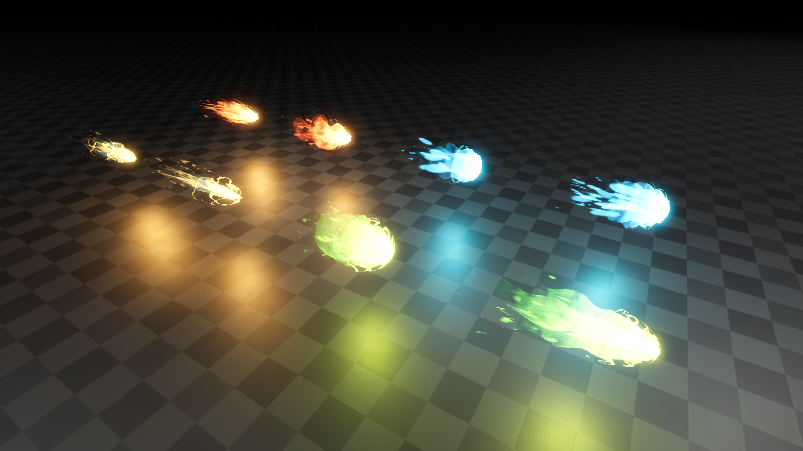
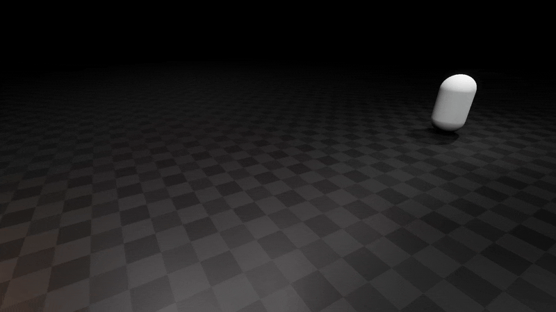
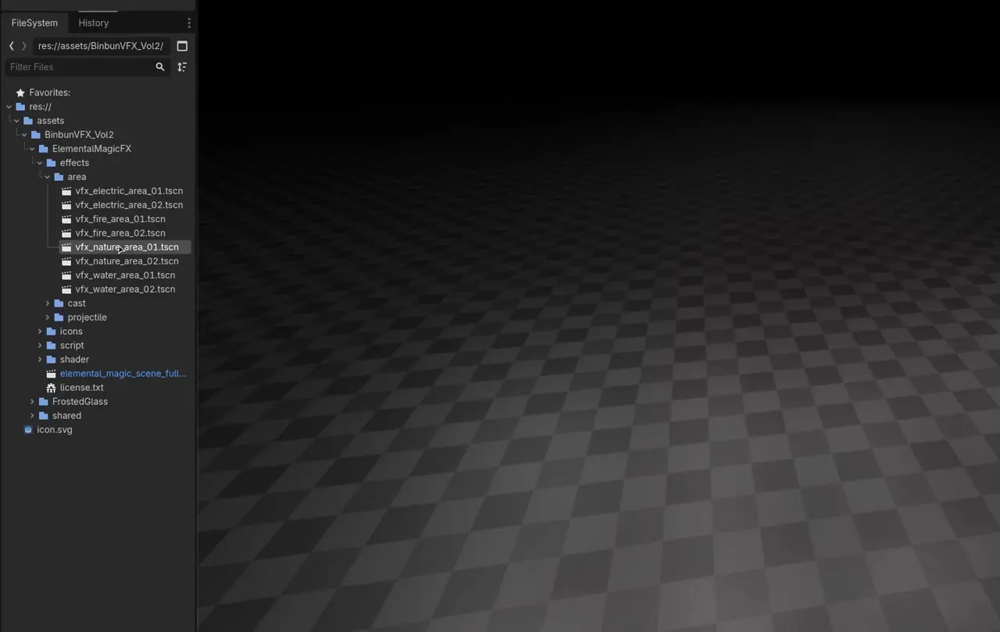
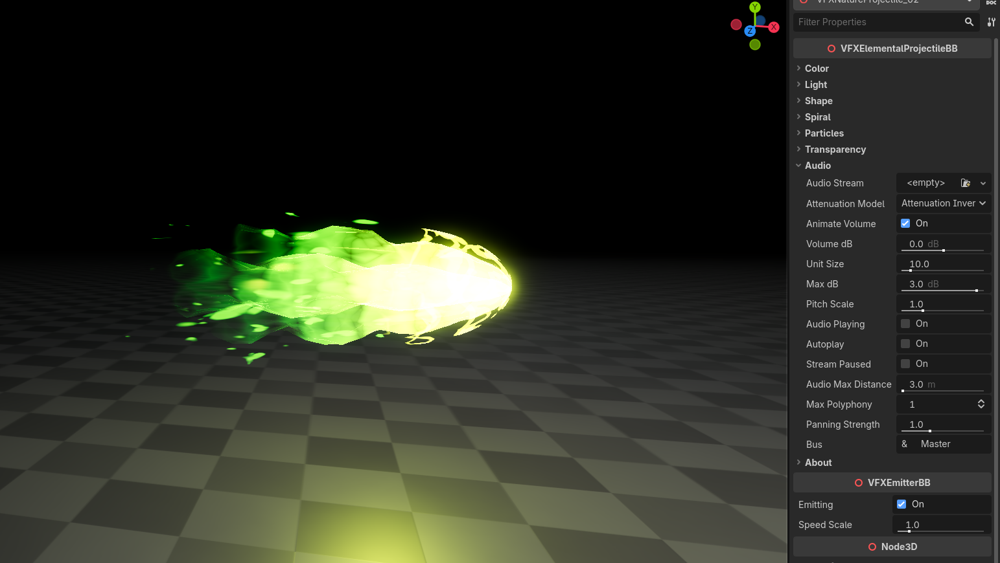

+++
date = '2026-03-31T10:43:18+03:00'
draft = true
title = 'Elemental Magic FX | Godot Effects'
tags = ["godot", "vfx", "asset"]
summary = "Elemental magic effects for Godot 4"
heroStyle = "big"
+++

Get Effects Here


Fire, water, electricity, nature. These are the elements bestowed upon thee, great Godot 4.x game developer. These customizable elemental magic effects even allow you to bend reality and create your own elements through the provided ancient scrolls (tool scripts and shaders). 

## Features

- Projectiles, area magic and casting effects (which also work as impact)
- Most effects based on noise textures, meaning you can easily change the look through the editor.
- Easy customizations of all the different aspects of the effect
    - Color and emission
    - Multiple parameters for shape and animation
    - Particle tweaks
    - Edge hardness with easy stylization
- Premade animations for opening and closing.
- Easy audio integration on effects



## Customization

All effects come with multiple parameters exposed in the inspector for easy customization. 

- Colors, emission and the transition curve between colors.
- Noise texture customization along with easily scaling and animating it.
- Particle tweaks like amount and speed.
- Transparency settings with hard edges giving a more stylized look.
- **Projectile specific parameters:**
    - Indepth surface "wave" parameters controlling the wobbly effect seen in above GIF.
    - Spiral trail effect tweaks.
    - Tail length.
- **Area specific parameters:**
    - Area radius.
    - Stepped animation with blending.
- More but you'll have to find out



---

## Usage

### Importing Effects to Godot

To import Elemental Magic FX to Godot, you can simply drag the provided `assets` folder in your Godot project directory.

In the case you have other assets from me, it's advised to override your existing `assets` folder to merge this one with the others.
This is because some of my assets use some shared textures, shaders and scripts, so merging the folders prevents any conflicts and 
overall keeps things simpler.

### Using effects

Effects can be found in `assets/BinbunVFX_Vol2/ElementalMagicFX/effects/`. Simplest way to use them is to simply drag and drop
them in your scene.

To turn effects on and off you can toggle `emitting`. Behind the scenes this plays an opening and closing animation depending on if the effect is turned on or off



### Spawning Effects Through Code

Below is an example function you can call to spawn an effect.

```GDScript
func spawn_effect() -> void:
    # Load and instantiate Electic Projectile 1. Path may vary based on where you extracted effects
    var effect = load("res://assets/BinbunVFX_Vol2/ElementalMagicFX/effects/projectile/vfx_electric_projectile_01.tscn").instantiate()
    add_node(effect)
```

### Audio

The effects include some audio settings. You can add a sound effect to the effects by simply dragging it to `Audio > Audio Stream`

Audio is animated in the same animations that control the effect, meaning the given sound effect will play at the right time automatically.

Audio settings are the same as with [AudioStreamPlayer3D](https://docs.godotengine.org/en/stable/classes/class_audiostreamplayer3d.html).



### Removing the "Rate This Effect!" button

If you find the "Rate This Effect!" button annoying, you're absolutely free to remove it. It's a new thing I'm trying out.

You can find the scripts for the effects in `assets/BinbunVFX_Vol2/ElementalMagicFX/script/`. At the bottom of that script you might see something like this:

``` GDScript
@export_tool_button("Rate This Effect!", "Favorites") var rate_asset_button : Callable:
	get():
		return func(): OS.shell_open("https://binbun3d.itch.io/elemental-magic-fx/rate")
```

Remove that and you're free from the button.
---

## Properties

Effects partly have similar properties which are listed here. Audio properties are the same as [AudioStreamPlayer3D](https://docs.godotengine.org/en/stable/classes/class_audiostreamplayer3d.html).


| Property | Description | Type |
| --- | --- | --- |
| `primary_color` | Controls what the color is at the core of the flames.  | **Color** |
| `secondary_color` | Controls the color flames transition to at the top. | **Color** |
| `tertiary_color` | Controls the color flames transition to at the top. | **Color** |
| `emission` | Emission of the effect. Essentially the brightness | **float** |
| `color_curve` | The curve used in the transition between colors | **float** |
| `light_color` | Color of the emitted light of this effect | **Color** |
| `light_energy` | Multiplier for the light's strength | **float** |
| `light_indirect_energy` | Secondary multiplier for the light's strength in indirect light | **float** |
| `light_volumetric_fog_energy` | Secondary multiplier for the light's strength in volumetric fog | **float** |
| `noise_texture` | The noise texture that's used for the shape of this effect. | **Texture2D** |
| `noise_scale` | Value used to scale the `noise_texture`. Higher values make the noise more zoomed out. Note that scales smaller than 1.0 can have hard edges. | **Vector2** |
| `noise_scroll` | The speed at which the `noise_texture` moves. | **Vector2** |
| `shape_curve` | The curve of the sampled noises gradient | **float** |
| `particles_amount` | Amount of particles emitted by this effect | **int** |
| `lifetime` | Lifetime of particles. | **float** |
| `explosiveness` | Explosiveness of the particles emitted. At 1.0 particles are emitted in batches. | **float** |
| `edge_hardness` | Hardness of the edges of each part of this effect. Also controls the transition of colors to have a harder edge | **float** |
| `edge_position` | The cutoff position of the effects edge. | **float** |


### VFXElementalProjectile

| Property | Description | Type |
| --- | --- | --- |
| `wave_scale` | Scale of the wave used to shape the `noise_texture`. Does not affect the big wobble. | **float** |
| `wave_speed` | Speed of the above mentioned wave | **float** |
| `wave_detail` | Adds extra detail to the wave by offsetting it using another wave | **float** |
| `wave_twist` | Twist of the wave shape | **float** |
| `tail_length` | Length of the tail. Does not affect physical size, just how far the fade reaches. | **float** |
| `streaks_width` | Width of the spiral streaks flying off the tip of the projectile. | **float** |
| `spiral_amount` | How strong the spiral effect is. Affects both the spiral trails and the wobble of the surface of the projectile. | **float** |
| `spiral_scale` | Scale of the spiral along the length of the projectile. | **float** |
| `spiral_count` | The amount of sections the spiral effect has. | **int** |
| `spiral_speed` | Speed at which the spiral effect moves | **float** |
| `spiral_noise` | How much the `noise_texture` affects the spiral effect. | **float** |


### VFXElementalArea

| Property | Description | Type |
| --- | --- | --- |
| `area_radius` | Radius of the area effect. Changes the mesh sizes. | **float** |
| `animation_steps` | "Choppiness" of area effect | **float** |


---

## Questions

### Can I use the effects in a commercial game? 

Yup. This pack is licensed under Creative Commons Zero (CC0). For more check the included license.txt file 

### Do I have to mention Binbun3D? 

No, but it's a great show of support to mention me!

### Pwease showcase my game Binbun O-O

Hit me up on my socials and I can see what we can do! I see it as a win-win for both of us.
