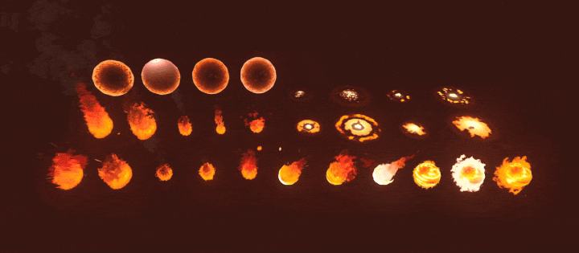
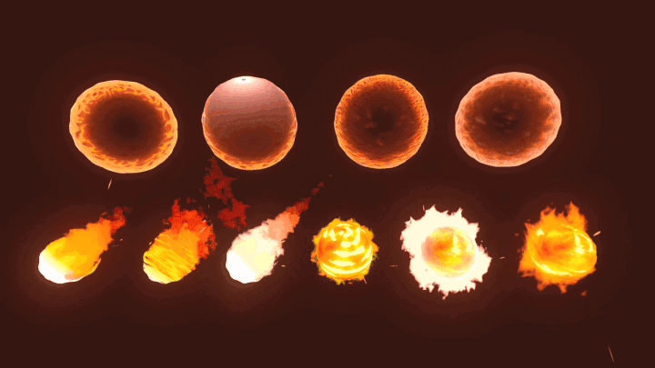

+++
date = '2026-03-06T11:31:29+02:00'
draft = true
title = 'Godot Fire VFX | Asset Pack'
tags = ["godot", "vfx", "3D", "asset"]
summary = "Fire effects for Godot 4"
heroStyle = "big"
+++

Get Effects Here


Fire VFX is a 3d vfx pack made for the Godot Engine.  It consists of 30 stylized fire visual effects to spice up your games!

## Included
- 10 Different Flame effects with varying sizes and shapes of flames
- 6 Fireball effects
- 4 Force Field effects
- 8 Ground Area effects
- Candle Flame
- Trail Flame

## Features
- Effects ready to use directly in your project!
- All effects are editable through exposed shader parameters. 
- Easily set emission and oneshot through tool script.
- Godot 4.x version
- Planned Updates to increase customizability and new effects!

## Licensing
You're free to use this pack for personal, educational and commercial projects with no attribution required (CC0)

