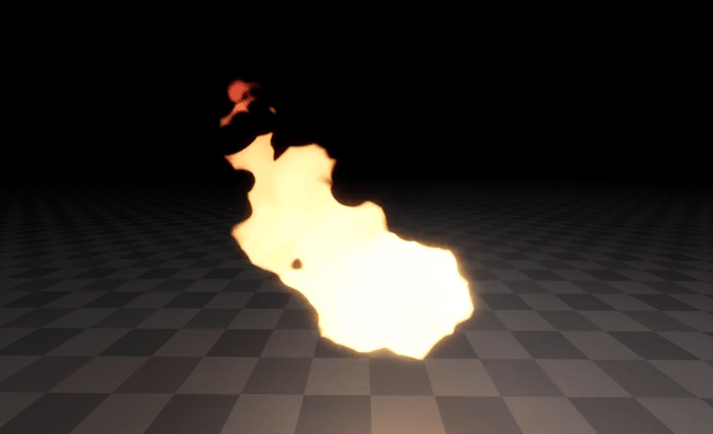
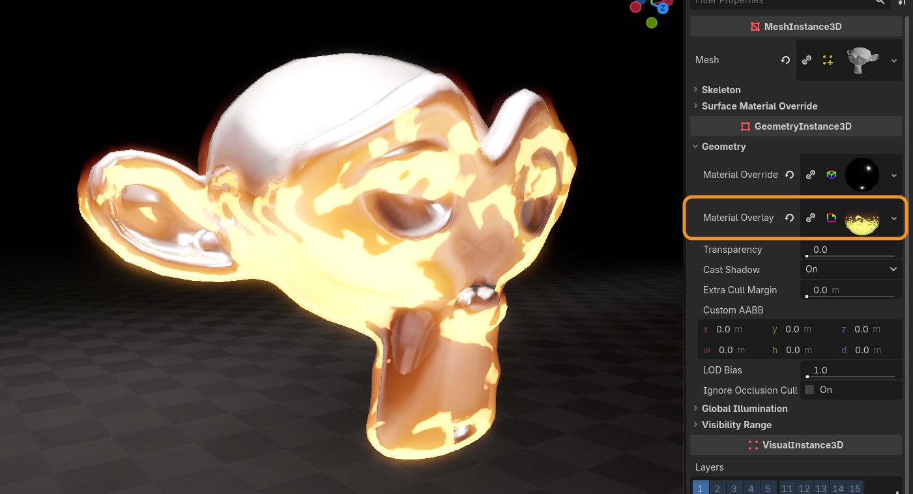
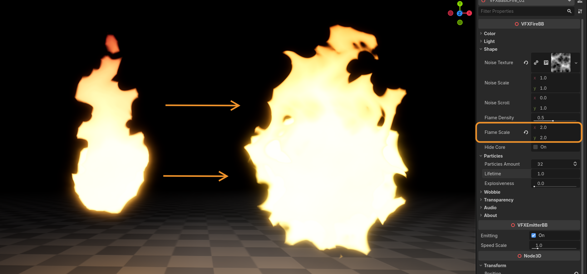
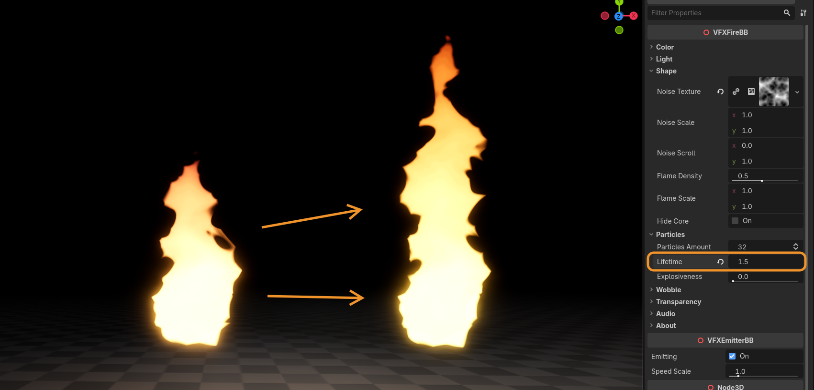
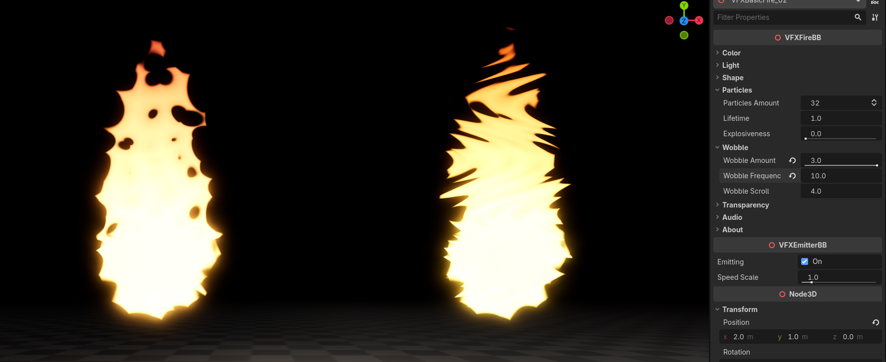
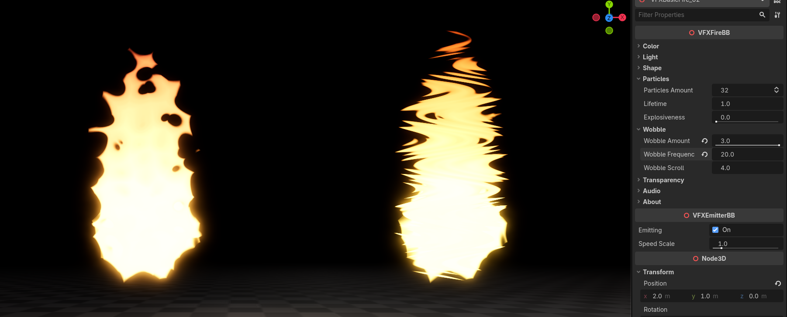
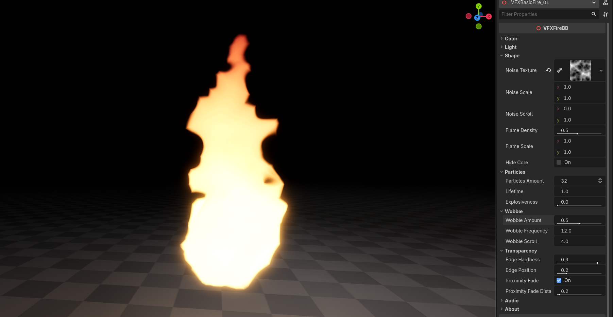

+++
date = '2026-03-26T18:17:41+02:00'
draft = false
title = 'Stylized Flame FX | Godot Effects'
tags = ["godot", "vfx", "asset", "fire"]
summary = "Flaming effects and their documentation for Godot 4"
heroStyle = "big"
+++

Get Effects Here


Heat up your Godot 4.x game with these flaming effects! Perfect for ambience, campfires, torches, 
projectiles and even status effects. These effects are FIRE (sorry for that joke).

## Features

- Naturally flowing flames even when moved around.
- Easily control the shape using a Godot's built in noise.
- Customizable colors, wobble, edge softness and more.
- Animations for turning flames on and off.
- Easy audio integration to animations.
- Overlay materials that can be added to any objects Material Overlay slot. (Demonstrated by our friend Suzanne the Monkey)



---
## Usage

### Importing Effects to Godot

To import Flame FX to Godot, you can simply drag the provided `assets` folder in your Godot project directory.

In the case you have other assets from me, it's advised to override your existing `assets` folder to merge this one with the others.
This is because some of my assets use some shared textures, shaders and scripts, so merging the folders prevents any conflicts and 
overall keeps things simpler.

### Using Fire Effects

Fire particle effects can be found under `assets/BinbunVFX_Vol2/FlameFX/effects`. 

When imported into **Godot**, you can simply drag the `.tscn` files from their respective folders to your scene. 

### Using Overlay Materials

Overlay materials can be found under `assets/BinbunVFX_Vol2/FlameFX/effects/overlays`

In addition to the fire particle effects, the pack also contains **fire overlay materials** that are meant to be assigned to any object in Godot
as an overlay, meaning it **won't mess with any existing materials** on that object.

1. Select the **MeshInstance** you want to set on fire.
2. Under **GeometryInstance3D > Geometry** you can find **Material Overlay**.
3. Drag the fire overlay material on the **Material Overlay** slot and you're done!



### Resizing Effects

You have a few different options for changing the size of the effect

To increase the base scale of the emitted particles, you can change `Shape > flame_scale` property.



You can also make the flames of the fire effect go higher by increasing the `Particles > lifetime`.



> [!WARNING]- It is ***not*** advised to use `Transform > Scale`
> Most likely it won't do anything except mess up the particles

### Wobble

Using the wobble properties you can give a nice wavy wobbly squiggly feel to the fire. It's basically using a sine wave based on the y direction to distort 
the noise texture used in the flame effect. 

You are able to increase `wobble_amount` beyond the suggested range of **0 to 1.0**:



With `wobble_frequency` you can make that wobble more frequent, or in other words more tightly packed:



### Removing the "Rate This Effect!" button

If you find the "Rate This Effect!" button annoying, you're absolutely free to remove it. It's a new thing I'm trying out.

You can find the script for VFXFireBB in `assets/BinbunVFX_Vol2/FlameFX/script/VFXFireBB.gd`. At the bottom of that script you might see something like this:

``` GDScript
@export_tool_button("Rate This Effect!", "Favorites") var rate_asset_button : Callable:
	get():
		return func(): OS.shell_open("https://binbun3d.itch.io/flame-fx/rate")
```

Remove that and you're free from the button.

---

## VFXFireBB

Fire effects come with a controller script for easy customizations in the inspector.



### Color


| Property | Description |
| --- | --- |
| `primary_color` | Controls what the color is at the core of the flames.  |
| `secondary_color` | Controls the color flames transition to at the top. |
| `emission` | Emission of the effect. Essentially the brightness |
| `color_curve` | The curve used in the transition between `primary_color` and  `secondary_color` |


### Light


| Property | Description |
| --- | --- |
| `light_color` | Color of the light emitted by the effect |
| `light_energy` | Strength multiplier of the light. ([godot docs link](https://docs.godotengine.org/en/stable/classes/class_light3d.html#class-light3d-property-light-energy)) |
| `light_indirect_energy` | Secondary strength multiplier of the light used with indirect light. ([godot docs link](https://docs.godotengine.org/en/stable/classes/class_light3d.html#class-light3d-property-light-indirect-energy)) |
| `light_volumetric_fog_energy` | Secondary strength multiplier of the light used with volumetric fog. ([godot docs link](https://docs.godotengine.org/en/stable/classes/class_light3d.html#class-light3d-property-light-volumetric-fog-energy)) |


### Shape


| Property | Description |
| --- | --- |
| `noise_texture` | The noise texture that's used for the shape of this effect. The entire effect is based on this noise texture, so the biggest changes can be achieved with it. Note that it is suggested to use a seamless texture (for Godot's NoiseTexture you can enable `seamless`) for best results. |
| `noise_scale` | Value used to scale the `noise_texture`. Higher values make the noise more zoomed out. |
| `noise_scroll` | The velocity at which the `noise_texture` moves. |
| `flame_density` | Controls the density of the flames. Essentially controls the blending between `noise_texture` and a radial gradient within each particle |
| `flame_scale` | Controls the size of meshes used in this effect. Use this to make your flames wider and bigger. |
| `hide_core` | Hides an extra part at the root of the flame used to make the root of the flames look more stable. |


### Particles


| Property | Description |
| --- | --- |
| `particles_amount` | Amount of particles used by this effect. Since this effect samples the `noise_texture` using world coordinates, the amount of particles won't have a big effect on the style of the flames. Increase this if the effect looks jittery. Turning it down a bit might give a slight performance boost. |
| `lifetime` | Lifetime of the flame particles. Increasing this will make the flames go higher. |
| `explosiveness` | Explosiveness of the flame particles. |


### Wobble


| Property | Description |
| --- | --- |
| `wobble_amount` | How much the flames are distorted side to side. |
| `wobble_frequency` | The frequency of wobble on the flames. Higher values results in a tighter wave |
| `wobble_scroll` | How fast the wave used to wobble the flames moves along the flames. Negative values move it downward. |


### Transparency 

| Property | Description | Type |
| --- | --- | ---: |
| `edge_hardness` | Hardness of the edges of flames. Setting this to `1.0` might break the illusion of a continuous flame. | **float** |
| `edge_position` | Position of the edge on the shape. Higher values can make the effect look smaller. | **float** |
| `proximity_fade` | Enables proximity fade. Can be performance intensive, but will also prevent effect from looking like it's clipping with surfaces. Happens **before** `edge_hardness` is calculated. | **bool** |
| `proximity_fade_distance` | Distance of `proximity_fade` | **float** |


### Audio


| Property | Description | Type |
| --- | --- | ---: |
| `animate_volume` | When enabled, will fade audio based on VFXEmitterBB parameter `emitting` | **bool** |

Other audio properties are the same as [AudioStreamPlayer3D](https://docs.godotengine.org/en/stable/classes/class_audiostreamplayer3d.html).

---

## Questions

### Can I use the effects in a commercial game?

Yes. This pack is licensed under Creative Commons Zero, meaning you're free to use it in a commercial game. For more information check the given license.txt file

### Do I have to mention Binbun3D?

Nope, but it's always appreciated!

### I want my game showcased by Binbun3D!!!!!

Hey that's not a question... It's a demand. Well lucky you I'd love to showcase games that use my assets! Send me a message on my socials and I'll see what I can do!
