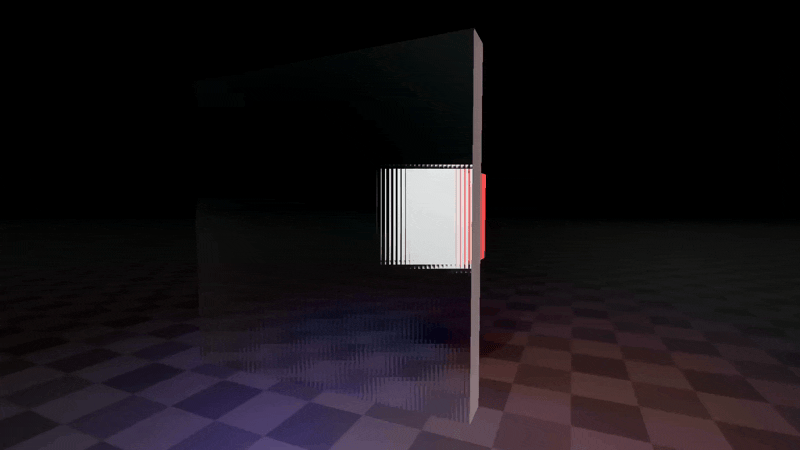
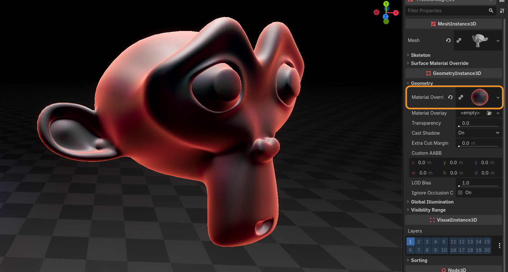

+++
date = '2026-03-29T10:57:51+03:00'
draft = true
title = 'Frosted Glass | Godot Shader'
tags = ["godot", "vfx", "asset", "shader"]
summary = "Frosted glass effects for Godot 4"
heroStyle = "big"
+++

Get Effects Here


Car windows on a cold winter night, privacy glass in an office, ice. All of these can be achieved with this Godot 4.x frosted glass shader. 

## Features

- Customizable refraction.
- For best looks, there's an optimized gaussian blur.
- For  best performance, there's mipmap based blur.
- A tiled refraction glass effect 
- Roughness that affects blur.
- Color abberation slider.
- Rim light.



---

## Usage

### Importing materials to Godot

To import materials to Godot you can just drag and drop them anywhere in your project.

If you have the full version and have any of my other packs installed, it's suggested to override your existing `assets`
folder with the one from this pack, since the demo scene uses some shared parts for the environment. You won't lose anything when
overriding!

### Using materials

To create new materials using the shaders, you can simply drag and drop the .gdshader file to the material slot on your 
**MeshInstance3D**.

In the full version, you can find presets in `assets/BinbunVFX_Vol2/FrostedGlass/effects`



### Performance

There's two versions of the frosted glass. 

The default frosted glass uses an optimized gaussian blur for the blur. Gaussian blur works by sampling the screen a bunch of times and the bigger the blur the more it has to sample. I've optimized it a bit by cutting down on the samples and replacing them with lower mipmap levels. 

The fast version of the frosted glass uses a fully mipmap based blur. This means that the blur effect is actually a lower resolution
version of the screen! This is really fast compared to the first option

Tips for performance:

- **Multiple unique materials can be bad**. If you have a house for example, try using the same glass material for
all the windows!
- **More blur = less performance**. Luckily the effect doesn't even look that good when blurred too much.

> [!TIP] Don't worry too much about performance
> Most likely you won't run into much issues with these. Just make the game! I believe in you

### Changing shaders from code 

To change shader parameters through code you can use the [ShaderMaterial](https://docs.godotengine.org/en/stable/classes/class_shadermaterial.html) function `set_shader_parameter()` 

Here's an example of a script attached to a **MeshInstance3D** with one of these frosted glass materials on the **Material Override**
slot.

```GDScript
func set_blur(amount : float) -> void:
    material_override.set_shader_parameter("blur_amount", amount)
```

---

## Shader parameters

Most of these apply to all the shaders, but I've marked the ones that don't apply to every one

### Color

| Parameter | Description | Type |
| --- | --- | --- | 
| `color` | The color of the glass | **vec4** |
| `color_coat` | Basically controls the mixing of the color the the glass effect. `0.0` means the color is just a tint on the glass, `1.0` makes the glass fully opaque with the color | **float** |
| `oiliness` | Slider to control how visible an additional "oily" color affects the color of the glass. Oily color is generated from the surface normal | **float** |


### Rim

| Parameter | Description | Type |
| --- | --- | --- |
| `rim_amount` | Blending of the rim | **float** |
| `rim_shape` | The exponent curve of the rim. Higher values make rim look smaller | **float** |
| `rim_color` | Color of the rim | `vec4` |


### Refraction

| Parameter | Description | Type |
| --- | --- | --- |
| `refraction_strength` | How much things seen through the object are deformed. Values greater than `0.0` make things shrink at the edges. Values less than `0.0` make things stretch at the edges | `float` | 
| `scatter_strength` **(scatter_glass)** | How much things are scattered by the scatter effect | **float** |
| `time_size` **(scatter_glass)** | How big the tiling of the scattering is | **float** | 


### Blur

| Parameter | Description | Type |
| --- | --- | --- |
| `blur_amount` **(frosted_glass, frosted_glass_fast)** | Controls the radius of the blur. Note that on **frosted_glass_fast** it controls the mipmap level, so the radius might not match the default one | **float** |
| `roughness_affect` | How much the roughness affects the blur. Turn this on if you have a roughness texture to get a nice icy glass effect | **float** |


### Roughness

These are basically the same stuff as any roughness parameters on any material.

---

## Questions

### Can I use the effects in a commercial game? 

Yup. For more check the included license.txt file 

### Do I have to mention Binbun3D? 

No, but it's a great show of support to mention me!

### Pwease showcase my game Binbun O-O

Hit me up on my socials and I can see what we can do! I see it as a win-win for both of us.
