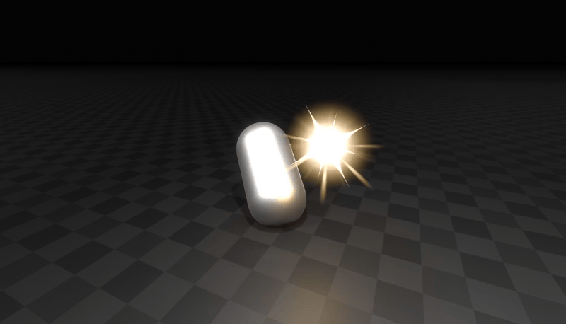
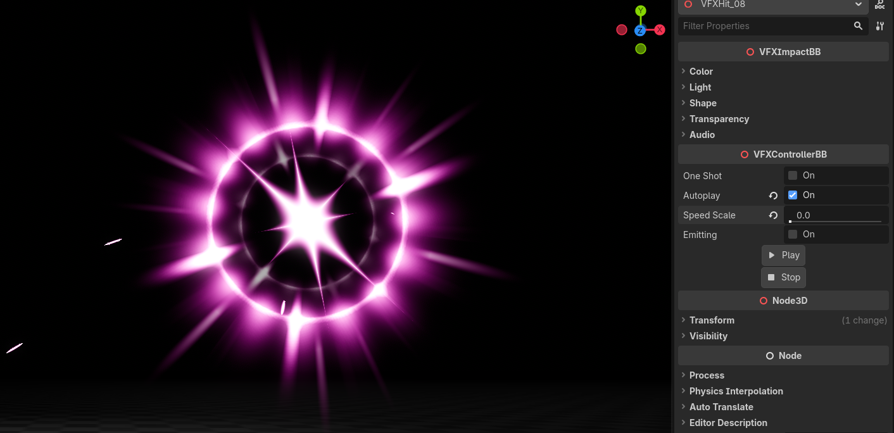
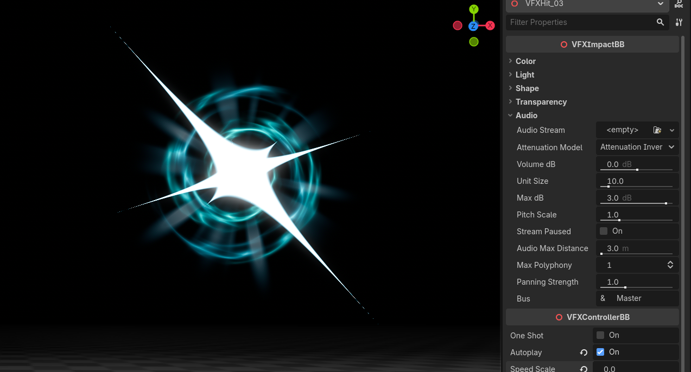
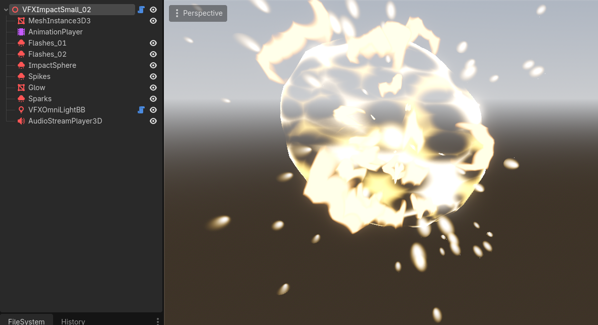
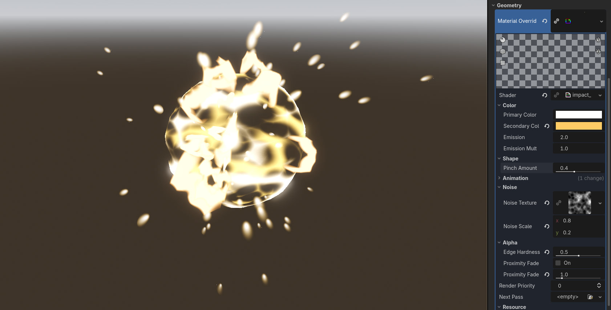
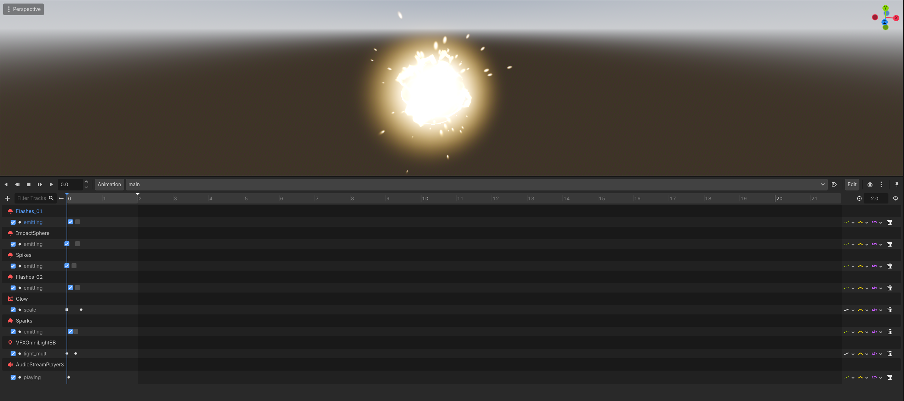

+++
date = '2026-03-27T11:25:52+02:00'
draft = true
title = 'Stylized Hit FX | Godot Effects'
tags = ["godot", "vfx", "asset", "impact"]
summary = "Hit and impact effects and their documentation for Godot 4"
heroStyle = "big"
+++

Get Effects Here


Can you see how that capsule takes hits in the first preview gif. I feel bad for them. 
Anyways these impactful hit effects are perfectly fit for fighting games, magic spells, 
and anything that requires some snappy juice. I promise they'll leave an impact on your Godot 4.x games!

## Features
- Impacts of different styles all the way from basic hit effects to magic
- Shaders for flares, streaks and explosions you can use elsewhere as well!
- Snappy hit effects and larger explosion impacts with variations in size and buildup time
- Customizations for colors, shape and transparency.
- Audio integration built in to the animation!



---

## Usage

### Importing effects to Godot

To import Hit FX to Godot, you can simply drag the provided `assets` folder in your Godot project directory.

In the case you have other assets from me, it's advised to override your existing `assets` folder to merge this one with the others.
This is because some of my assets use some shared textures, shaders and scripts, so merging the folders prevents any conflicts and 
overall keeps things simpler.

### Using Effects

Simplest way to use these effects is simply by dragging and dropping them in your scene!

You can find the effects in `assets/BinbunVFX_Vol2/StylizedHitFX/effects`.

All effects come with a controller script you can tweak to fit your needs. Basic options for playing animations can be found under **VFXControllerBB**

- `oneshot` makes animation play only once
- `autoplay` plays it automatically when loading a scene
- `speed_scale` affects speed of animation.
- You can play and stop the animation with the given buttons, `emitting` is for easily doing it through code, but it does the same thing.



### Spawning Effects Through Code

Stylized Hit FX includes some features to help you spawn them through code. Below is an example function you can call to spawn an effect.

```GDScript
func spawn_hit() -> void:
    # Load and instantiate Hit 01. Path may vary based on where you extracted effects
    var effect = load("res://assets/BinbunVFX_Vol2/StylizedHitFX/effects/hit/vfx_hit_01.tscn").instantiate()

    # Make sure effect plays automatically and add it to the scene. 
    # Autoplay can also be toggled in the effect scene
    effect.autoplay = true 
    add_node(effect)
    
    # Effects include a "finished" signal you can use to free the effect after it played
    effect.finished.connect(func():
        effect.queue_free()
    )
```

### Audio

The effects include some audio settings. You can add a sound effect to the effects by simply dragging it to `VFXImpactBB > Audio > Audio Stream`

Audio is animated in the same animations that control the effect, meaning the given sound effect will play at the right time automatically.

Audio settings are the same as with [AudioStreamPlayer3D](https://docs.godotengine.org/en/stable/classes/class_audiostreamplayer3d.html).



### Deeper Customizations

The internal structure of effects will vary, but they mostly consist of similar parts. If you're unsure what each node does, I encourage you to
turn down the `speed_scale` to freeze the effect and hiding different nodes to see what they do



Most of the cool stuff is handled within the different shaders that are applied to the **MaterialOverride** slot. Try changing them around!
Easiest way to customize them is by simply swapping the noise textures!



Effects are animated within the **AnimationPlayer**. Since most parts are handled by **GPUParticles3D** nodes, the animations are mostly just setting the `emitting`
values of them. You can play with the timing by moving the tracks around



---

## VFXImpactBB

### Color

| Property | Description | Type |
| --- | --- | --- |
| `primary_color` | The most prominant color | **Color** |
| `secondary_color` | The color that effects fade into at edges | **Color** |
| `emission` | Emission of the effect. Higher values give glowyness if glow is enabled in environment. | **float** |


### Light


| Property | Description | Type | 
| --- | --- | --- |
| `light_color` | Color of the light emitted by the effect | **float** |
| `light_energy` | Strength multiplier of the light. ([godot docs link](https://docs.godotengine.org/en/stable/classes/class_light3d.html#class-light3d-property-light-energy)) | **float** |
| `light_indirect_energy` | Secondary strength multiplier of the light used with indirect light. ([godot docs link](https://docs.godotengine.org/en/stable/classes/class_light3d.html#class-light3d-property-light-indirect-energy)) | **float** |
| `light_volumetric_fog_energy` | Secondary strength multiplier of the light used with volumetric fog. ([godot docs link](https://docs.godotengine.org/en/stable/classes/class_light3d.html#class-light3d-property-light-volumetric-fog-energy)) | **float** |


### Shape

| Property | Description | Type |
| --- | --- | --- |
| `flash_pinch` | Changes the shape of the flashes flying off impacts | **float** | 
| `flash_noise_scale` | Changes the noise scale of the flashes flying off impacts | **Vector2** |
| `hide_core` | On Impact effects hides the glowy ball in the middle. On hit effects hides the star | **bool** |


### Transparency

| Property | Description | Type |
| --- | --- | --- |
| `edge_hardness` | Hardness of effect's edges. | **float** |
| `proximity_fade` | Fade effects close to other surfaces. Can affect performance, but prevents the effect from having hard clipping edges. | **bool** |
| `proximity_fade_distance` | Distance of the proximity fade. Does nothing if proximity_fade is not enabled | **float** |


### Audio

Audio properties are the same as [AudioStreamPlayer3D](https://docs.godotengine.org/en/stable/classes/class_audiostreamplayer3d.html).

---

## Questions

### Can I use the effects in a commercial game?

Yes. This pack is licensed under Creative Commons Zero, meaning you're free to use it in a commercial game. For more information check the given license.txt file

### Do I have to mention Binbun3D?

No, but you can show support by mentioning me. It's always appreciated!

### I want my game showcased by Binbun3D!!!!!

You can send me a link to your itch page on my socials and I'll see if I can include it in the "Games using my assets" section on my itch.io page!
