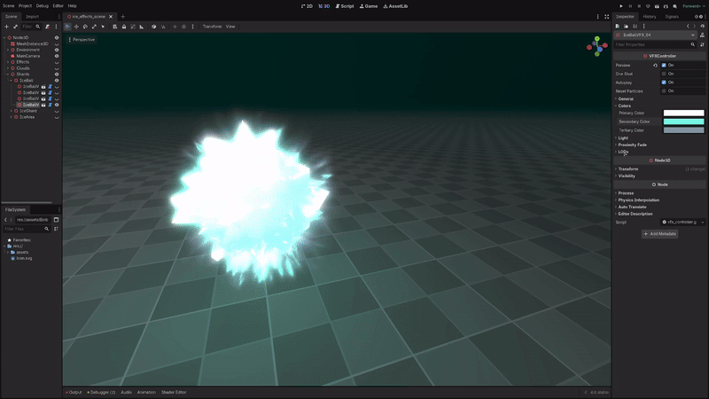
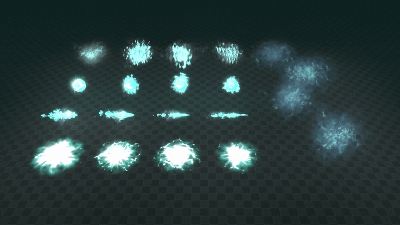

+++
date = '2026-03-06T10:48:48+02:00'
draft = false
title = 'Godot Ice VFX | Asset Pack'
tags = ["godot", "vfx", "3D",  "asset"]
summary = "Ice effects for Godot 4"
heroStyle = "big"
+++

Get Effects Here


Freeze the world with ice using [this Godot 4.x VFX pack](https://binbun3d.itch.io/ice-vfx). Need elemental ice projectiles? Or maybe you just want to give that freezing cold feeling with some icey ambiance. Consider these effects! 

## Included
- 4 Ice Areas
- 4 Ice Projectiles
- 4 Ice Balls
- 4 Small Sharp Ice Clouds
- 4 Bigger Cold Mist Clouds
- All the textures, materials used to make this, available for your creations.

## Customization
All effects come with a tool script that allows you to easily customize the effects to your liking directly in the editor.

- Easily change the color of effects 
- Adjust the light emitted by the effects
- Enable and tweak proximity fade
- Adjust the speed of effects  
- Set one shot and autoplay
- Custom Dithering to stylize the effects 

## Licensing
You're free to use this pack for personal, educational and commercial projects with no attribution required (CC0). License does not cover demo version.
