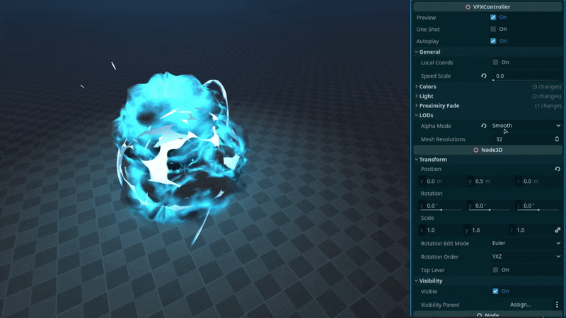
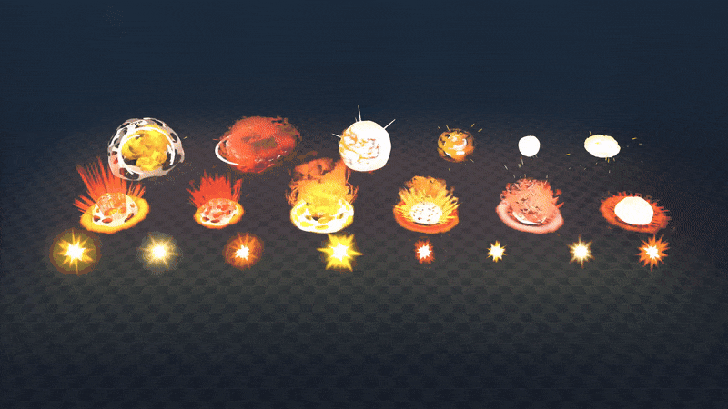

+++
date = '2026-03-06T11:15:05+02:00'
draft = false
title = 'Godot Impact VFX | Asset Pack'
tags = ["godot", "vfx", "3D", "asset"]
summary = "Impact effects for Godot 4"
heroStyle = "big"
+++

Get Effects Here


Upgrade the visuals of your Godot game with Impact VFX. Give juice to interactions, add impact to your mechanics, or simply fill in the gaps with these customizable game ready visual effects.

## Included
- 3 Big Explosions with varying designs
- 3 Small Explosions made to fit their size
- 6 Ground Impact Effects with varying shapes and sizes
- 8 Hit Effects for smaller impacts
- Shaders and Textures used in the effects totaling over 20

## Customizability
All effects come with a tool script that allows you to easily customize the effects to your liking directly in the editor.

- Easily change the color of effects
- Adjust the light emitted by the effects
- Enable and tweak proximity fade
- Adjust the speed of effects
- Set one shot and autoplay
- Custom Dithering to stylize the effects 

## Licensing
You're free to use this pack for personal, educational and commercial projects with no attribution required (CC0).
