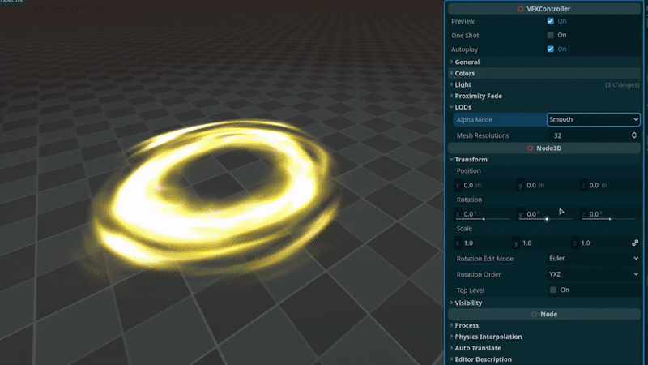
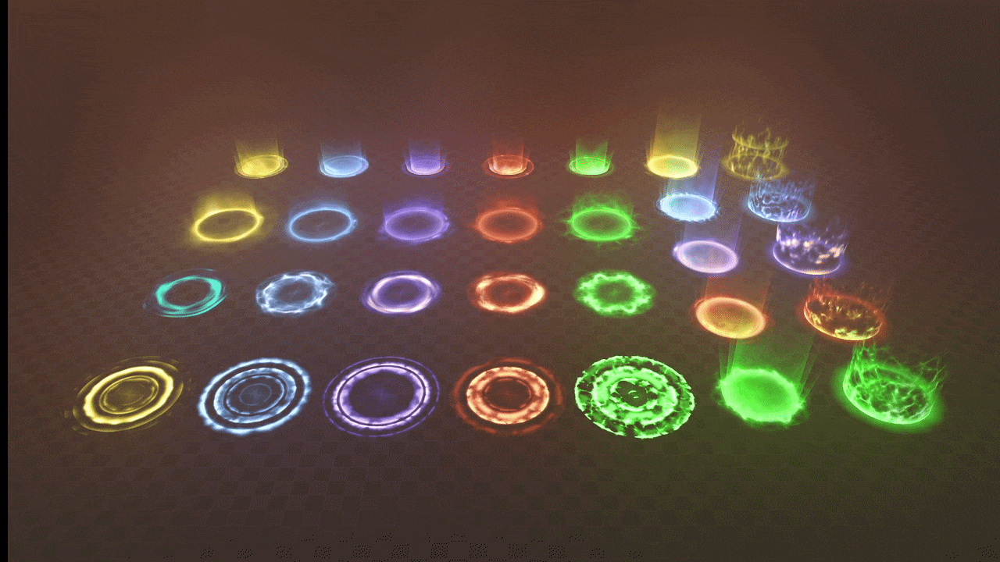

+++
date = '2026-03-06T10:48:48+02:00'
draft = false
title = 'Godot Magic Areas VFX | Asset Pack'
tags = ["godot", "vfx", "3D",  "asset"]
summary = "Magic area effects for Godot 4"
heroStyle = "big"
+++

Get Effects Here


Bring magical glow to your Godot 4.x projects. [These 30 effects](https://binbun3d.itch.io/magic-area-vfx) are perfect for magical attacks, spells, item pickups and whatever you come up with!

## Included
- 5 Small Area Effects
- 5 Misty Glow Area Effects
- 5 Ripple Area Effects
- 5 Pulse Area Effects
- 5 Tall "Pillar" Area Effects
- 5 Lift Areas
- Over 30 Different Textures used in making these.

## Customization
All effects come with a tool script that allows you to easily customize the effects to your liking directly in the editor.

- Easily change the color of effects 
- Adjust the light emitted by the effects
- Enable and tweak proximity fade
- Adjust the speed of effects  
- Set one shot and autoplay
- Custom Dithering to stylize the effects 

## Licensing
You're free to use this pack for personal, educational and commercial projects with no attribution required (CC0). License does not cover demo version.
