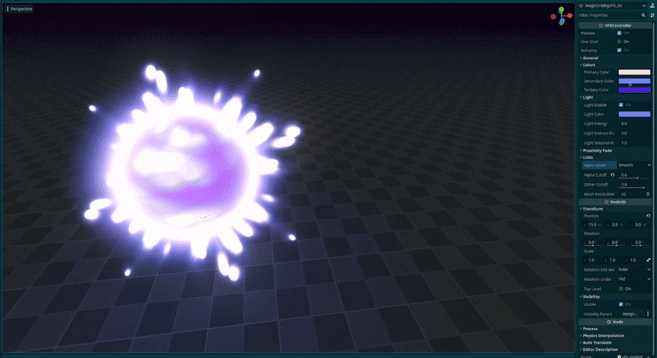
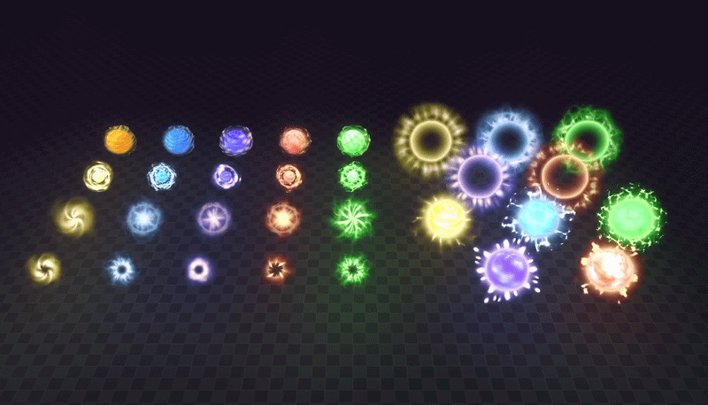

+++
date = '2026-03-06T10:40:54+02:00'
draft = true
title = 'Godot Magic Orbs VFX | Asset Pack'
tags = ["godot", "vfx", "3D",  "asset"]
summary = "Magic orb effects for Godot 4"
heroStyle = "big"
+++

Get Effects Here


Hear ye all witches, wizards, warlocks and magi. A delivery from the high council has arrived with a message: 
"Take these orbs and shape them to your liking in the Godot Game Engine Version 4.x". I don't know what the high council knows about Godot, 
but what I do know is with [this collection of Magic VFX](https://binbun3d.itch.io/magic-orb-vfx/purchase) you can bring flare to your beautiful games. They work as projectiles, spells and much more.

## Included
- 10 Small Effects.
- 10 Misty Spiral Effects.
- 5 Big Glowing Rim Effects.
- 5 Big Burst Effects.
- All the materials used. Available for use in your own creations.
- Over 30 Textures used in these effects.

## Customization
All effects come with a tool script that allows you to easily customize the effects to your liking directly in the editor.

- Easily change the color of effects 
- Adjust the light emitted by the effects
- Enable and tweak proximity fade
- Adjust the speed of effects  
- Set one shot and autoplay
- Custom Dithering to stylize the effects 

## Licensing
You're free to use this pack for personal, educational and commercial projects with no attribution required (CC0). License does not cover demo version.
