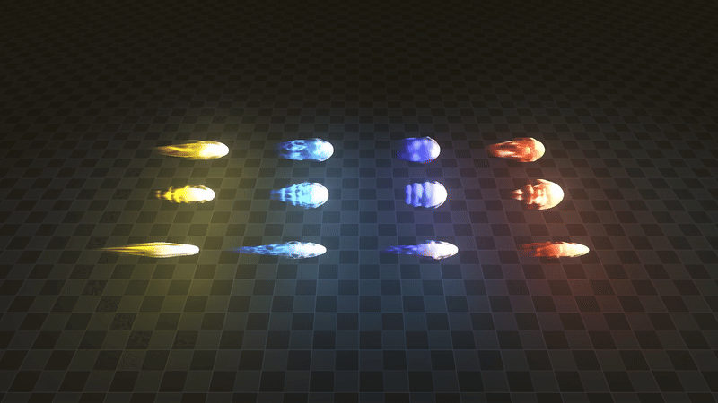
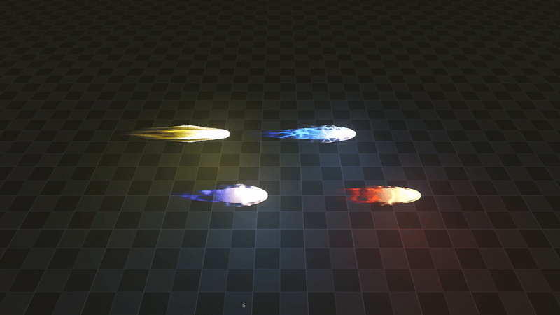

+++
date = '2026-03-06T11:36:01+02:00'
draft = true
title = 'Godot Magic Projectiles VFX | Asset Pack'
tags = ["godot", "vfx", "3D", "asset"]
summary = "Magic projectile effects for Godot 4"
heroStyle = "big"
+++

Get Effects Here


The Grand Mage has given me the task to deliver spells to you, but this time I've chosen to disobey their rule and give them out for free. These projectiles will fit right into your fantastical worlds of magic. 

## Included
- 4 Basic Effects.
- 4 Wavy Effects.
- 4 Sharp Javelin Effects.
- Every texture and material used to make these.

## Customization
All effects come with a tool script that allows you to easily customize the effects to your liking directly in the editor.

- Easily change the color of effects 
- Adjust the light emitted by the effects
- Enable and tweak proximity fade
- Adjust the speed of effects  
- Set one shot and autoplay
- Custom Dithering to stylize the effects 

## Licensing
You're free to use this pack for personal, educational and commercial projects with no attribution required (CC0). 

