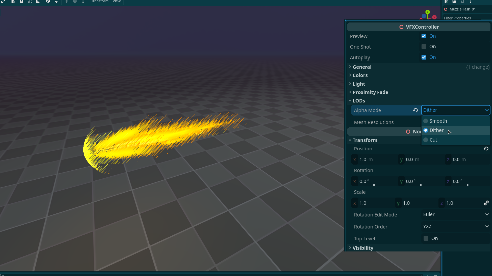
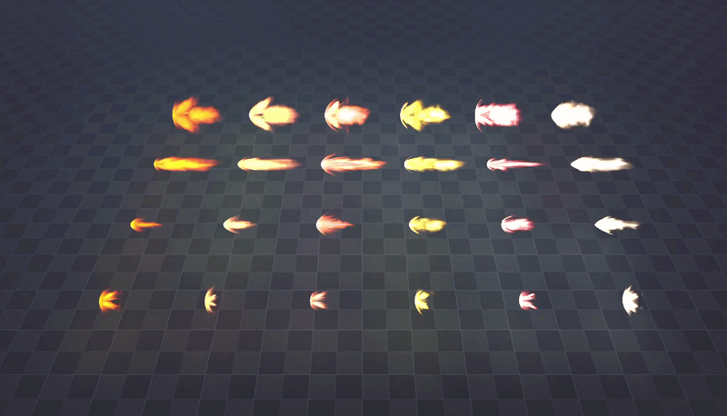

+++
date = '2026-03-06T11:21:15+02:00'
draft = true
title = 'Godot Muzzle Flash VFX | Asset Pack'
tags = ["godot", "vfx", "3D", "asset"]
summary = "Muzzle flash effects for Godot 4"
heroStyle = "big"
+++

Get Effects Here


Make your weapons pop. These 24 flash effects are perfect for any weapons. Guns, cannons and even tanks.  And they're completely free <3. Made for  Godot 4.x.

## Inlcuded
- 6 Medium flashes using different textures
- 6 Small flashes with different textures
- 6 Very small flashes with different textures
- 6 Big flashes with different textures
- 12 Textures, All the materials and all the shaders used to make these.

## Customization
All effects come with a tool script that allows you to easily customize the effects to your liking directly in the editor.

- Easily change the color of effects 
- Adjust the light emitted by the effects
- Enable and tweak proximity fade
- Adjust the speed of effects  
- Set one shot and autoplay
- Custom Dithering to stylize the effects 

## Licensing
You're free to use this pack for personal, educational and commercial projects with no attribution required (CC0).
