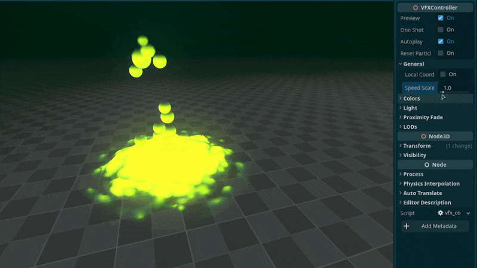
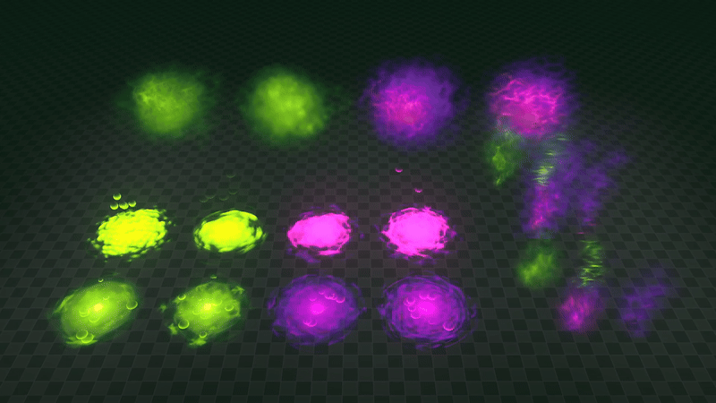

+++
date = '2026-03-06T11:07:44+02:00'
draft = false
title = 'Godot Poison VFX | Asset Pack'
tags = ["godot", "vfx", "3D", "asset"]
summary = "Poison effects for Godot 4"
heroStyle = "big"
+++

Get Effects Here


What's that..? The radioactive rats from the sewers bring you some visual effects. Ooze up your Godot 4.x games with [these poison effects](https://binbun3d.itch.io/poison-vfx/purchase). Perfect for status effects, smelly areas or even nuclear waste.

## Included
- 4 Bubbly puddles of ooze.
- 4 Ripple areas of poison.
- 4 Poison cloud effects.
- 8 Different poison smoke/smell effects.
- 4 Poison pop effects.
- All the materials and textures used. Available for use in your own creations.

## Customization
All effects come with a tool script that allows you to easily customize the effects to your liking directly in the editor.

- Easily change the color of effects 
- Adjust the light emitted by the effects
- Enable and tweak proximity fade
- Adjust the speed of effects  
- Set one shot and autoplay
- Custom Dithering to stylize the effects 

## Licensing
You're free to use this pack for personal, educational and commercial projects with no attribution required (CC0). License does not cover demo version.
