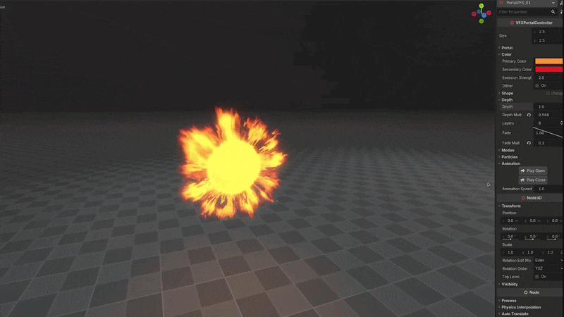
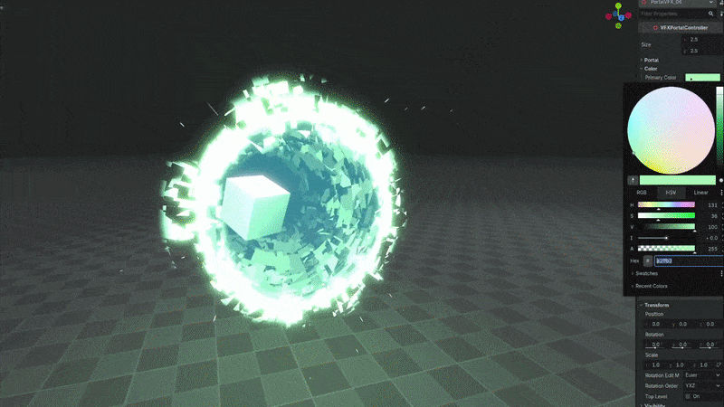

+++
date = '2026-03-06T09:11:36+02:00'
draft = false
title = 'Godot Portal VFX | Asset Pack'
tags = ["godot", "vfx", "3D",  "asset"]
summary = "Portal effects for Godot 4"
heroStyle = "big"
+++

Get Effects Here


Feed your need for portals in Godot 4.x with [***this portal pack***](https://binbun3d.itch.io/godot-portal-vfx)! A window to another world right in your hands.

## Features
- Parallax effect giving depth.
- Built in support for stencil buffer, allowing you to make things easily only visible through the portal.
- Option to warp the objects seen through the portal like a lens.
- Pre-made animations for opening and closing.
- Shape based on a gradient texture, meaning you can simply change to achieve any shape (square for example).
- Stylization options like hard edges, dithering, changing color, changing the noise texture etc.
- Everything easily customizable through a controller script.

## Versions
The free version includes everything listed in the Features section with a simple portal as a base, meaning everything is possible by just tweaking things in the editor.

Paid version includes 24 preset portals with premade textures and shapes. These inlcude circular, oval and rectangular portals for each style

## Licensing
You're free to use this pack for personal, educational and commercial projects with no attribution required (CC0).
