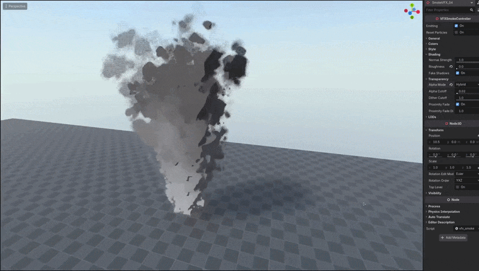
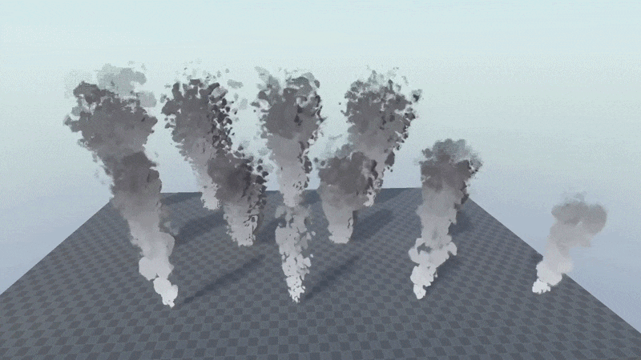

+++
date = '2026-03-06T11:26:23+02:00'
draft = false
title = 'Godot Dynamic Smoke VFX | Asset Pack'
tags = ["godot", "vfx", "asset"]
summary = "Dynamic smoke effects for Godot 4"
heroStyle = "big"
+++

Get Effects Here


Add smoke to your games with these dynamic Godot 4.x Smoke VFX Effects. They fit into cars, chimneys, fireplaces, factories etc. and with deep customizability you can make them fit right in your game.

## Features
- Customizable shading from flat to smooth to hard shadows.
- Change smoke density with one slider.
- Switch between smooth, dithered and hard cut edges for different looks.
- Proximity fade to blend the effect with surrounding geometry.
- Swap colors and change the speed easily.
- Optimize the effects to your needs by lowering resolutions, disabling shadows changing emission amount.
- All this easily configurable in the editor from one Smoke Controller script

## Included
- VFXSmokeController for easy customization.
- 24 Presets with differing stylization.
    - 8 Big smoke effects with smooth and toon variations
    - 8 Medium smoke effects with smooth and toon variations
    - 8 Thin smoke effects with smooth and toon variations.
- All the Textures, Materials and Shaders used.

## Licensing
You're free to use this pack for personal, educational and commercial projects with no attribution required (CC0).
