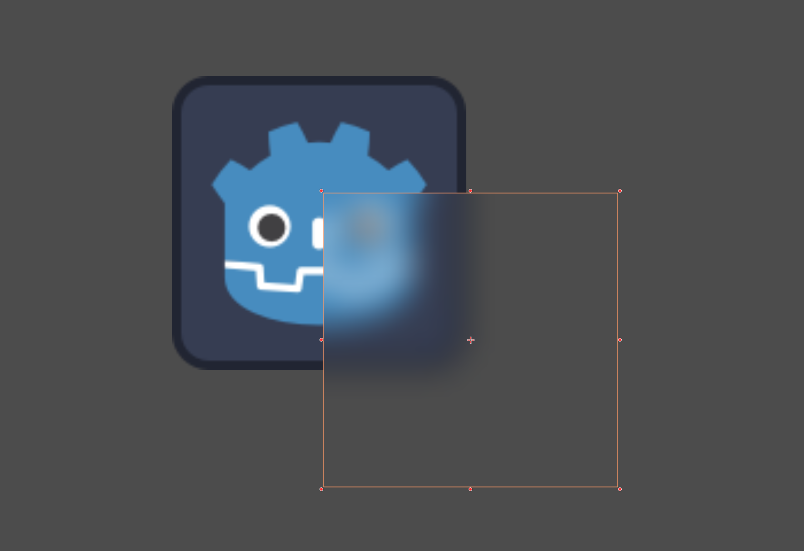

+++
date = '2026-03-05T14:48:47+02:00'
draft = false
title = 'Godot 2D Blur Shader | Tutorial'
tags = ["godot", "shader", "tutorial"]
summary = "A simple and performant blur shader for Godot 4"
+++
This is a tutorial about a very simple and very performant blur shader for **Godot 4**. If you just want the shader skip [here](#full-shader).
> [!NOTE] I used this method in my [Free Glass UI Shader](https://binbun3d.itch.io/fluid-glass-ui)
## About Blurring
There's a bunch of different blur algorithms used in computer graphics. 
Most of them work by sampling adjacent pixels to get an average color for them, which introduces a major problem.

- **More blur > More pixels to sample > Less performance**

Luckily in **Godot** we don't have to do that, because of one nice feature present in almost all the game engines.

## Mipmaps
Mipmaps are a sequence of low-res versions of textures (I think you know where I'm going with this). They're usually used for things like:
- [Level Of Detail](https://en.wikipedia.org/wiki/Level_of_detail_(computer_graphics))  
- Speeding up rendering
- Reduce aliasing (see image below)

And the great part is: **Godot does this automatically for us!** 


## Breakdown
To achieve the effect shown in the cover image, you'll first have to create a **ShaderMaterial** and add it to the material slot 
of any **Canvas Item** (ColorRect, Sprite2D, TextureRect etc). 

### Uniforms
```GLSL
shader_type canvas_item;

uniform float blur_amount : hint_range(0.0, 8.0) = 2.0;
uniform sampler2D screen_texture : hint_screen_texture, filter_linear_mipmap;
```

- `blur_amount` is used to control the amount of blur (of course)
    - `hint_range` is a flag used to tell Godot that the value will be withing this range. It's not necessary, but it adds a nice slider for the uniform in the editor.
- `screen_texture` gives us access to the image on the screen.
    - `hint_screen_texture` tells Godot that it is in fact the screen texture. Otherwise it'd be a texture like any other.
    - `filter_linear_mipmap` is important as it allows us to sample lower resolutions of the screen texture.

> [!IMPORTANT] Blurring won't work without `filter_linear_mipmap`

### Fragment
In the `fragment()` function we really only do one thing
```GLSL
void fragment(){
    vec4 color = textureLod(screen_texture, SCREEN_UV, blur_amount);
    COLOR = color;
}
```
- For `color` we use `textureLod()` to sample the screen texture.
    - `SCREEN_UV` is the UV coordinates of the current pixel on the screen.
    - We use our `blur_amount` to sample a specific mipmap level (Higher value > lower resolution)
    - Because we specified earlier that `screen_texture` would use `filter_linear_mipmap`, we'll get a nice blurred version of the screen.

> [!TIP]+ To blur only one image do this:
> Without `hint_screen_texture` you can set the texture in the **Shader Parameters** of your material.
> 
> Make sure you enable **Mipmaps > Generate** under the **Import** settings of your texture
>
> In this case you should use `UV` instead of `SCREEN_UV`

## Full shader
```GLSL
shader_type canvas_item;

uniform float blur_amount : hint_range(0.0, 8.0) = 2.0;

uniform sampler2D screen_texture : hint_screen_texture, filter_linear_mipmap;

void fragment() {
	vec4 color = textureLod(screen_texture, SCREEN_UV, blur_amount);
	COLOR = color;
}
```


