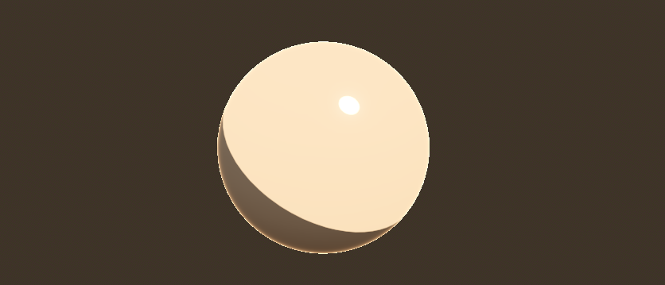
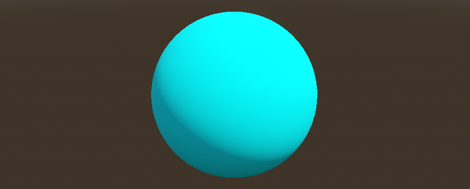
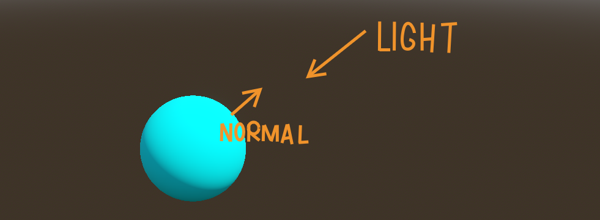
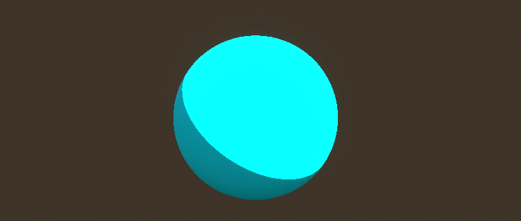
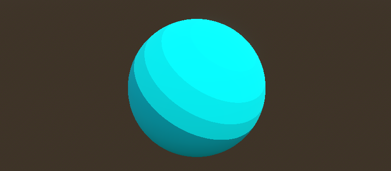
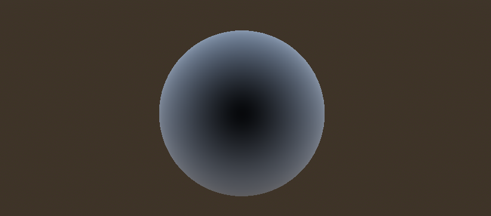
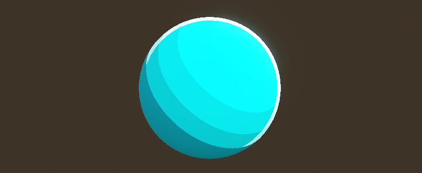
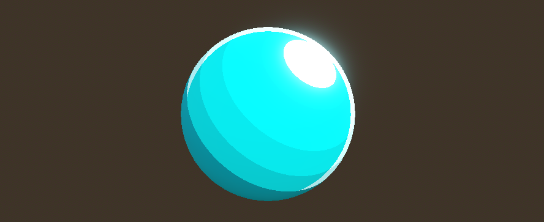

+++
date = '2026-03-09T08:00:40+02:00'
draft = false
title = 'Godot Toon Shading | Tutorial'
tags = ["godot", "tutorial", "shader", "toon"]
summary = "A guide for achieving nice toon shading in Godot 4"
+++
One thing almost every game developer has at least come across is toon shading.

> [!IMPORTANT] Check out my ***Ultimate Toon Shader***.
> It's free: https://binbun3d.itch.io/godot-ultimate-toon-shader

## What is toon shading
As the name suggests, toon shading aims for a car**toon**y shading instead of a realistic one.
Maybe that's also why toon shading is a form of [Non-photorealistic rendering](https://en.wikipedia.org/wiki/Non-photorealistic_rendering). 
It's also known as cel shading.

There's no ***one true toon shading***, but usually you'll see a few things:

- Hard shadows
- Defined rim light
- Clear highlights

> [!NOTE] You might see ***outlines*** mentioned, but it's less of a shading thing.

<figure>
    
    <figcaption>Toon shading image <a href="https://commons.wikimedia.org/wiki/User:NicolasSourd">NicholasSourd</a> (<a href="https://creativecommons.org/licenses/by/2.5/">CC BY 2.5</a>)</figcaption>
</figure>

## Simple Method
The simplest method for toon shading is to use Godot's own **StandardMaterial3D**. 

1. Add the **StandardMaterial3D** to object.
2. Open the material and switch it to *toon mode*:
    - **Shading > Diffuse Mode** to **Toon**
    - **Shading > Specular Mode** to **Toon**
3. Drag the **Roughness** of the material to `0.0`
4. **(Optional)**: Enable **Rim > Enabled**



Easy as that. A great benefit for this is you can use all the other things that come with **StandardMaterial3D**.

## Custom Shader
Of course we want full control, so we'll go ahead and build our very own toon shader!
But before we get to the good stuff we can add some color to our material.

```GLSL
shader_type spatial; // Since this is a 3D shader, it'll be spatial

uniform vec3 albedo : source_color; // We can set this in the editor

void fragment() {
	ALBEDO = albedo;
}

void light() {
    // This is what we'll be focusing on from now
}
```

### The `light()` function
As a first example, instead of jumping directly to the toon shader, we'll start with [lambertian lighting](https://en.wikipedia.org/wiki/Lambertian_reflectance).
You can read more about it from the link, but for our purposes it's pretty much just **matte lighting without highlights**

```GLSL
void light() {
	DIFFUSE_LIGHT += max(dot(NORMAL, LIGHT), 0.0) * ATTENUATION * LIGHT_COLOR / PI;
}
```



There's a lot happening here so let's break it down:

- `dot(NORMAL, LIGHT)` is the **core** of our whole lighting
    - `NORMAL` is the **direction of the surface**, `LIGHT` is the **direction of the light**
    - By using `dot()` we're calculating the **angle** between `NORMAL` and `LIGHT` ([the dot product](https://en.wikipedia.org/wiki/Dot_product)).
    - So when the light points towards the surface, the angle between the surface and the light is 180 degrees (which is PI in radians, **that's why we divide by `PI` later**), 
    which means the more the light points towards the surface, the higher the value
- `max(dot(NORMAL, LIGHT), 0.0)` simply means we choose which value is higher, so in practice it means our **light value can never be less than 0.0**
- `ATTENUATION` represents how much the intensity of the light is reduced due to things like **distance** from the light source and **shadows from other objects**.
- `LIGHT_COLOR` is pretty self explanatory. Colored lights wouldn't work without it

The reason we add onto `DIFFUSE_LIGHT` is because the `light()` function runs **per-pixel** ***per-light***, so if we just set it to our value
we'd override all the previously processed lights.



### Hard Shadows
For clarity, we'll break down our previous `light()` into multiple lines so we can work with individual values.
Then we can use the `step()` function to get a hard edge for the shading.

```GLSL
void light() {
	float light = max(dot(NORMAL, LIGHT), 0.0) * ATTENUATION;

	light = step(0.1, light); // Here
	
	vec3 diffuse = vec3(light) * LIGHT_COLOR / PI;
	
	DIFFUSE_LIGHT += diffuse;
}
```



#### Multiple Steps
We can go even further and instead of using `step()` we can:

1. **Multiply** our `light` by the amount of steps we want it to have.
2. **Round** the value.
3. **Divide** it with the amount of steps to scale the value back.

```GLSL
void light() {
	float light = max(dot(NORMAL, LIGHT), 0.0) * ATTENUATION;
	light = round(light * 4.0) / 4.0; // Here
	
	vec3 diffuse = vec3(light) * LIGHT_COLOR / PI;
	
	DIFFUSE_LIGHT += diffuse;
}
```



### Rim light
For rim light we can use the fresnel effect. We'll write a seperate function for it:

```GLSL
float fresnel(vec3 normal, vec3 view)
{
	return 1.0 - clamp(dot(normalize(normal), normalize(view)), 0.0, 1.0));
}
```



- Again we use `dot()`, but this time to find the angle between the view direction and the surface `NORMAL`
    - So when the surface points directly to us, the value is higher. 
- Then we invert it by subtracting it from **1.0**
    - So when the surface points directly to us, the value is **0.0**

Next we can actually use it in our `light()` function. 

```GLSL
void light() {
	float light = max(dot(NORMAL, LIGHT), 0.0) * ATTENUATION;
	light = round(light * 4.0) / 4.0;
	
	vec3 diffuse = vec3(light) * LIGHT_COLOR / PI;
	
	DIFFUSE_LIGHT += diffuse;

	float rim = fresnel(NORMAL, VIEW);
	rim = step(0.7, rim);
	rim *= light;

    SPECULAR_LIGHT += vec3(rim) * LIGHT_COLOR / PI;
}
```



- We get `rim` by using our `fresnel()`
- **Step** it using `step()` like we did with the shading earlier
- We **multiply** the `rim` with our `light` value so that the rim light is only visible in the lighter areas
- **Add** it to `SPECULAR_LIGHT` instead of `DIFFUSE_LIGHT`. Idk why but it feels more appropriate.

### Fake Specular highlights
We already used `SPECULAR_LIGHT` here, but we haven't added actual specular highlights yet. Let's fix that!
To keep things a simple, we won't actually implement ***real specular highlights***. It's a whole topic itself.

Instead we'll simply implement fake specular highlights using the same method as we did with `diffuse`.

```GLSL
void light() {
	float light = max(dot(NORMAL, LIGHT), 0.0) * ATTENUATION;
	light = round(light * 4.0) / 4.0;
	
	vec3 diffuse = vec3(light) * LIGHT_COLOR / PI;
	
	DIFFUSE_LIGHT += diffuse;

	float rim = fresnel(NORMAL, VIEW);
	rim = step(0.7, rim);
	rim *= light;

    SPECULAR_LIGHT += vec3(rim) * LIGHT_COLOR / PI;
    
    float specular = max(dot(NORMAL, LIGHT), 0.0) * ATTENUATION;
    SPECULAR_LIGHT += vec3(specular) * LIGHT_COLOR / PI;
}
```



If you'd like to do actual specular highlights I suggest [looking here](https://github.com/RustyRoboticsBV/GodotStandardLightShader).

## Full Shader
Here's the full shader:

```GLSL
shader_type spatial; 

uniform vec3 albedo : source_color;

void fragment() {
	ALBEDO = albedo;
}

float fresnel(vec3 normal, vec3 view)
{
	return 1.0 - clamp(dot(normalize(normal), normalize(view)), 0.0, 1.0));
}

void light() {
	float light = max(dot(NORMAL, LIGHT), 0.0) * ATTENUATION;
	light = round(light * 4.0) / 4.0;
	
	vec3 diffuse = vec3(light) * LIGHT_COLOR / PI;
	
	DIFFUSE_LIGHT += diffuse;

	float rim = fresnel(NORMAL, VIEW);
	rim = step(0.7, rim);
	rim *= light;

    SPECULAR_LIGHT += vec3(rim) * LIGHT_COLOR / PI;
    
    float specular = max(dot(NORMAL, LIGHT), 0.0) * ATTENUATION;
    SPECULAR_LIGHT += vec3(specular) * LIGHT_COLOR / PI;
}
```

