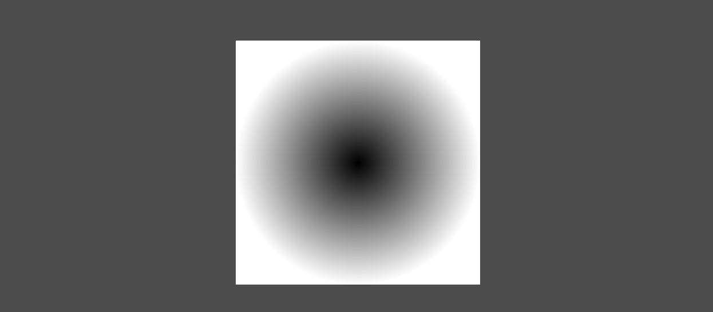
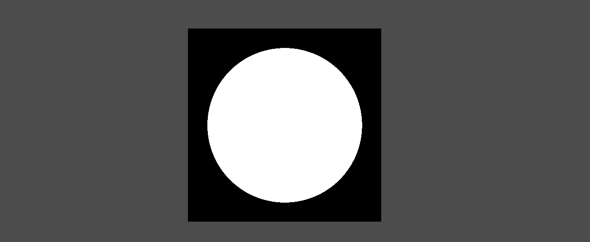
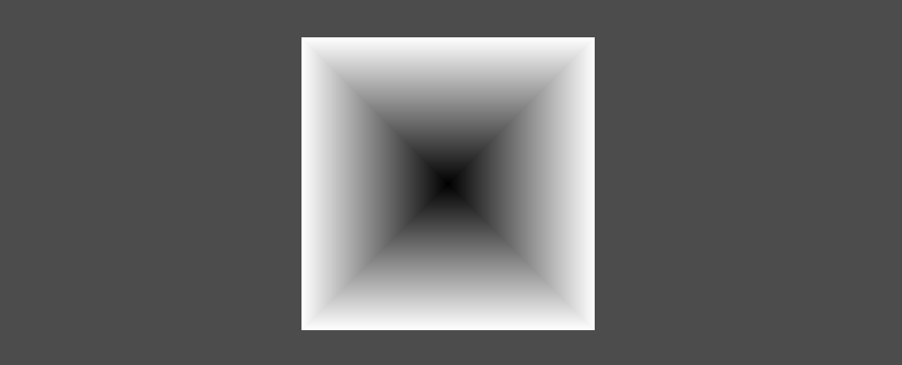
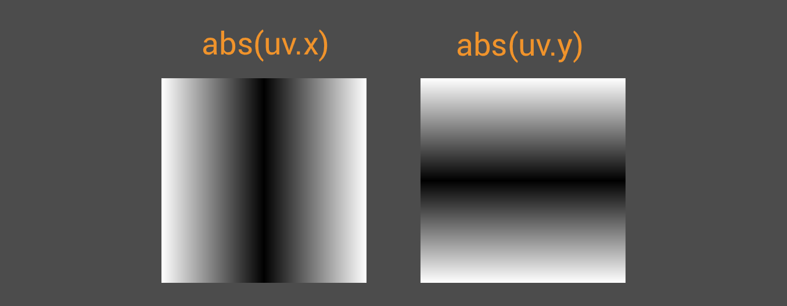

+++
date = '2026-03-07T17:58:24+02:00'
draft = false
title = 'Generating Shapes Using UV in Godot Shaders | Tutorial'
tags = ["godot", "shader", "tutorial"]
summary = "A guide about generating simple shapes in Godot Shaders"
series = ["UV"]
series_order = 3
+++
In the [first part](../godot_uv_basics/#shapes) I briefly covered using `UV` to get a gradient, but this tutorial will focus on generating more stuff!
We'll start with the humble circle.

---

## Circle
For ages humans have obsessed over drawing a ***perfect circle***. We don't have to, because it's pretty simple!
We start out with a radial gradient.

```GLSL
void fragment() {
	vec2 uv = UV;
	uv = uv * 2.0 - 1.0;
	
	float gradient = length(uv);
	
	COLOR.rgb = vec3(gradient);
}
```



- `uv = uv * 2.0 - 1.0;` pretty much centers our `uv` not too unlike in the [scaling tutorial](../godot_manipulating_uvs/#scaling-around-a-point).
    - In other words we map `x` and `y` of `uv` to a range from **-1 to 1** when normally they range from **0 to 1**
- `float gradient = length(uv)` we get the length our `uv`
    - In other words the distance to `(0.0, 0.0)`

So our `gradient` value here represents the distance to the center. Near the center it's darker, because the distance is shorter.
Next we can use `step()` to get a hard edge.

```GLSL
void fragment() {
	vec2 uv = UV;
	uv = uv * 2.0 - 1.0;
	
	float gradient = length(uv);
    gradient = step(gradient, 0.8)
	
	COLOR.rgb = vec3(gradient);
}
```



I ain't a mathematician so I can't explain what the step function does behind the scenes. For us it's just a shorter version of doing this:

```GLSL
void fragment() {
	vec2 uv = UV;
	uv = uv * 2.0 - 1.0;
	
	float gradient = length(uv);
    if(gradient > 0.8){
        gradient = 0.0;
    } else {
        gradient = 1.0;
    }
	
	COLOR.rgb = vec3(gradient);
}
```

> [!NOTE] I'm making *heavy* use of this in my [free portal vfx](../../../assets/vfx/godot_portal_vfx/)

---

## Square
The ColorRect is already a square we don't need to do anything

No I'm just kidding. Similarly to circles, we can get a square gradient which can be used for different things.

```GLSL
void fragment() {
	vec2 uv = UV;
	uv = uv * 2.0 - 1.0;
	
	float gradient = max(abs(uv.x), abs(uv.y));
	
	COLOR.rgb = vec3(gradient);
}
```



- `abs()` gets the absolute value of the given value.
    - "Absolute value" here means its distance from 0.0. So it just turns negative values into positives.
    - Because we map our `uv` value to a range from **-1 to 1**, using `abs()` makes our gradient value go from **1 to 0 to 1**
    - `max()` compares two values and returns the one that's greater.



> [!TIP] There's also `min()` which returns the lesser value.
> If you've used any graphics/drawing programs you might've come across **Lighten** and **Darken** blend modes. They're actually just `max()` and `min()`.

---

## Conclusion
Yeah we can make some shapes for sure.
By this time I've been writing for hours on end. I might update this part later with more shapes. On the next post we'll cover some interesting stuff with different coordinate spaces,
so if you're interested drop me a follow on my socials to stay updated
