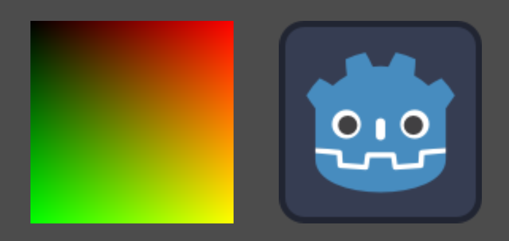
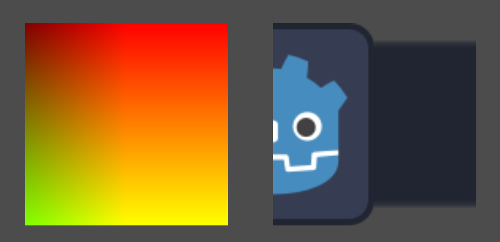
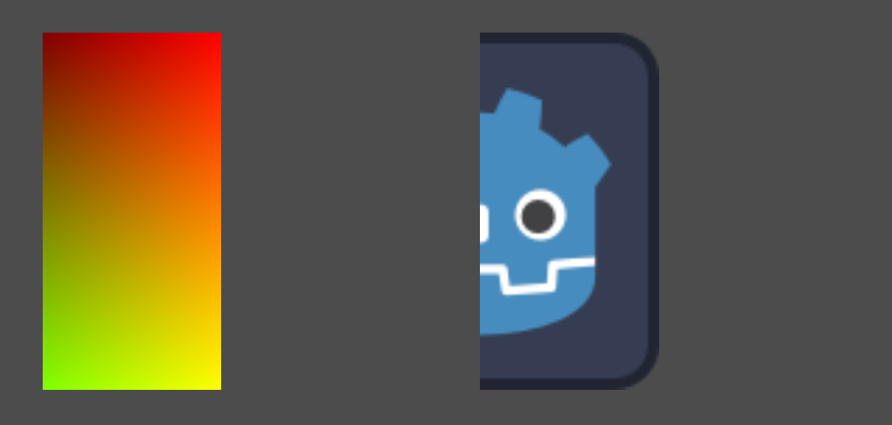
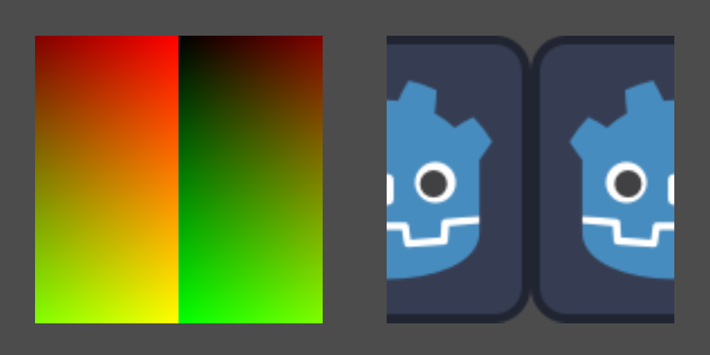
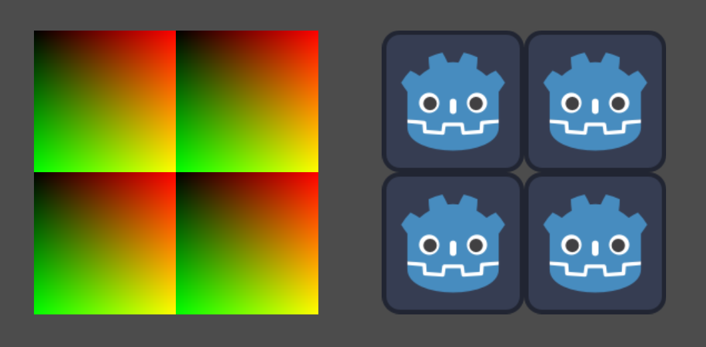
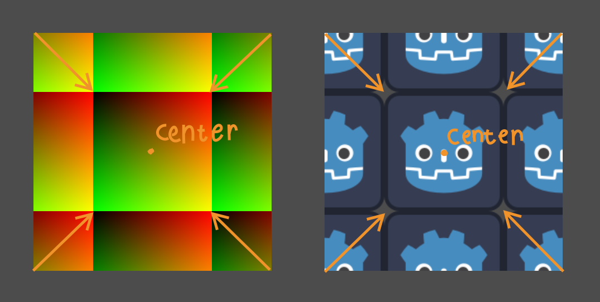
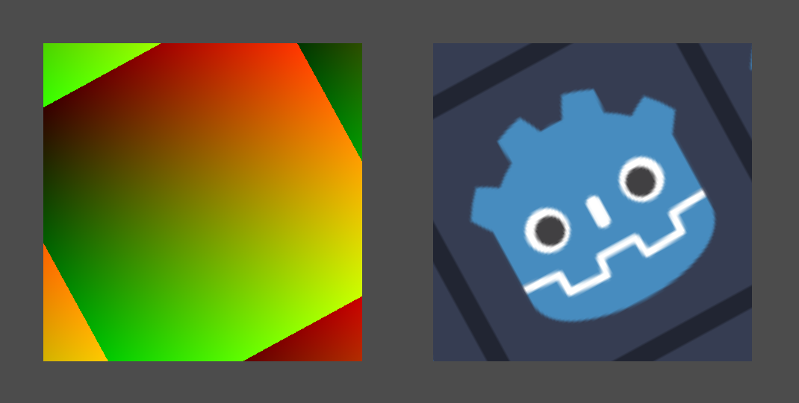

+++
date = '2026-03-07T13:50:28+02:00'
draft = false
title = 'Moving Scaling and Rotating UVs in Godot Shaders | Tutorial'
tags = ["godot", "shader", "tutorial"]
summary = "A guide to moving, scaling and rotating UVs in Godot shaders"
series = ["UV"]
series_order = 2
+++
In the [first part](../godot_uv_basics/) we covered the basics of coordinates, we even wrote this simple shader (which we'll use in this part):

```GLSL
shader_type canvas_item; // 2D shaders are canvas_items

// uniform is a variable you can see in the editor
// sampler2D means it's a texture
uniform sampler2D our_texture; 

void fragment() {
    vec4 color = texture(our_texture, UV); // Sample our texture at the current UV
    COLOR = color; // Assign the color to the pixel
}
```

Going forward in this tutorial all the images will show `UV` on the left and the final colors on the right like this:



---

## Moving
First of all to make things clearer we'll seperate `UV` into its own variable

```GLSL
void fragment() {
    vec2 uv = UV; // Assign UV to our own uv value for easier manipulation

    vec4 color = texture(our_texture, uv); 
    COLOR = color; 
}
```

Unlike with **Nodes** in GDScript, there is no `position` we can assign values to. Instead we have to offset `UV`. 
This is pretty simple though (or is it? (foreshadowing?)). You just add your offset to it. 

```GLSL
void fragment() {
    vec2 uv = UV;
    uv.x += 0.5;

    vec4 color = texture(our_texture, uv); 
    COLOR = color; 
}
```



### Problems
Of course it isn't actually that simple. A few things happen here:
- Since we're still limited to the area of our **Node**, we can't move the texture outside of that area. For that you'll have to just move the Node itself
- Adding `0.5` will offset the texture, but because the texture expects `UV.x` to only range from `0.0` to `1.0`, the parts where `UV.x` 
is above `1.0` after our addition (eg. the right half) will simply use the color that's at the edge of the texture

We can solve our problem in a few ways though

#### Solution 1: Discarding pixels
If we simply don't want there to be anything beyond our moved texture, we can use [discard the pixels](https://docs.godotengine.org/en/stable/tutorials/shaders/shader_reference/shading_language.html#discarding)

```GLSL
void fragment() {
    vec2 uv = UV;
    uv.x += 0.5;
    if(uv.x > 1.0){
        discard;
    }

    vec4 color = texture(our_texture, uv); 
    COLOR = color; 
}
```



This is visually equivalent of making the pixel transparent by setting `COLOR.a` (The alpha channel) to `0.0`,
which might be more performant (but the difference is negligent in our situation).

```GLSL
void fragment() {
    vec2 uv = UV;
    uv.x += 0.5;

    vec4 color = texture(our_texture, uv); 
    COLOR = color; 

    if(uv.x > 1.0){
        COLOR.a = 0.0;
    }
}
```

#### Solution 2: Tiling
We can also tile the texture by basically wrapping the `UV` value using the [modulo operation](https://en.wikipedia.org/wiki/Modulo).

```GLSL
void fragment() {
    vec2 uv = UV;
    uv.x += 0.5;
    uv = mod(uv, 1.0); 

    vec4 color = texture(our_texture, uv); 
    COLOR = color; 
}
```



---
> [!WARNING] Check out my [itch.io](https://binbun3d.itch.io/) for vfx stuff and cool shaders or else I'll ***scale*** you I guess

## Scaling
Like with moving we can scale our `UV` value. You can do that with multiplication.
One thing to remember is that we are not **scaling the texture itself**, but rather the coordinates with which the texture is sampled.

This means that when you're multiplying `UV` by `2.0` you're not making the texture twice as big, but rather the coordinates from which its sampled.

In short: Multiplying by `2.0` makes the texture twice as small.

```GLSL
void fragment() {
    vec2 uv = UV;
    uv *= 2.0;
    uv = mod(uv, 1.0); 

    vec4 color = texture(our_texture, uv); 
    COLOR = color; 
}
```



### Scaling around a point
Scaling by multiplying will scale the `UV` around the point where `UV` is `(0.0, 0.0)`. By default that's the top left.
To change the point around which we scale, we have to first offset the UVs, then scale, then offset them back.

```GLSL
void fragment() {
    vec2 uv = UV;
    vec2 center = vec2(0.5);

    uv += center;
    uv *= 2.0;
    uv -= center;

    uv = mod(uv, 1.0); 

    vec4 color = texture(our_texture, uv); 
    COLOR = color; 
}
```



### Reusable scaling function
To make things clean and reusable we can move the scaling to its own function

```GLSL
vec2 scale(vec2 uv, vec2 center, vec2 amount) {
    uv -= center;
    uv *= amount;
    uv += center;
    return uv;
}

void fragment() {
    vec2 uv = UV;

    uv = scale(uv, vec2(0.5), vec2(0.5))

    uv = mod(uv, 1.0); 

    vec4 color = texture(our_texture, uv); 
    COLOR = color; 
}
```

## Rotation
For rotation we'll write a rotation function where we can use what we learned with scaling to rotate around whichever point we want.

```GLSL
vec2 rotate(vec2 uv, vec2 center, float angle){
    uv -= center;

    float s = sin(angle);
    float c = cos(angle);

    uv = vec2(
        uv.x * c - uv.y * s,
        uv.x * s + uv.y * c
    );

    uv += center;
    return uv
}
```

I don't want to explain how that works because otherwise I would just ramble on about sine and cosine and would never finish this guide.
Just know it works. 

> [!IMPORTANT]+ This function expects **radians** for the angle
> Pi radians is equal to 180 degrees. Also you don't have to write the whole 3.14159... and so on you can just use `PI`.
> 
> `PI / 2.0` would be 90 degrees.

Anyways if we then use our `rotate()` function in the fragment shader we can rotate our texture like this!

```GLSL
void fragment() {
	vec2 uv = UV;
	
	uv = rotate(uv, vec2(0.5), 0.5);
	
	uv = mod(uv, 1.0);
	
    vec4 color = texture(our_texture, uv); 
    COLOR = color; 
}
```



## What's next?
Next up we'll look at generating our own shapes with only `UV` and a little math
