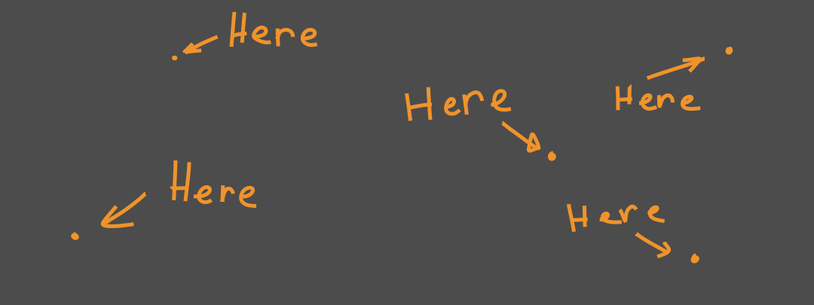
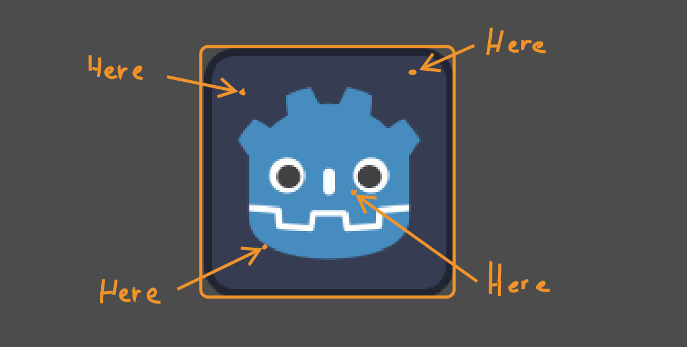
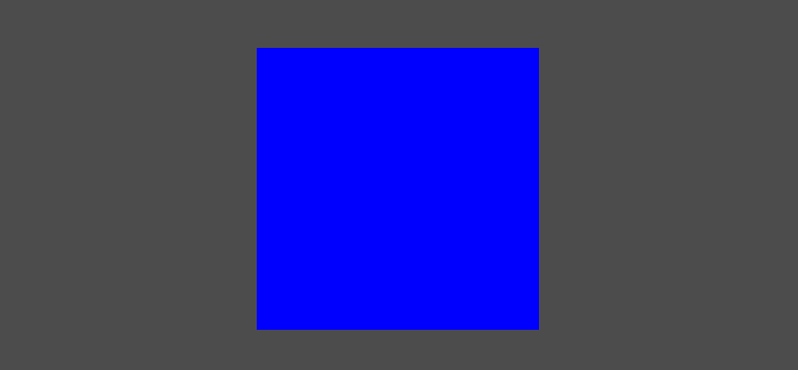
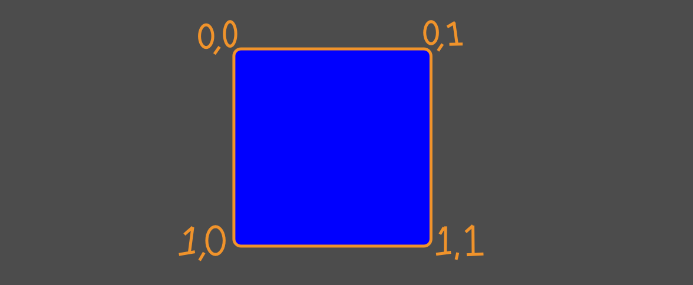
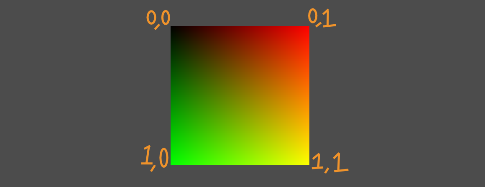
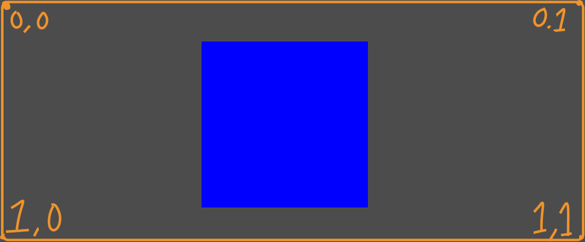
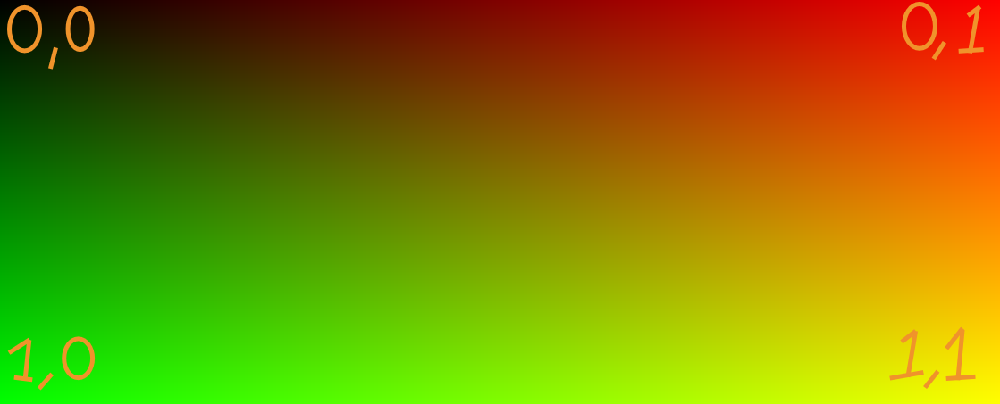
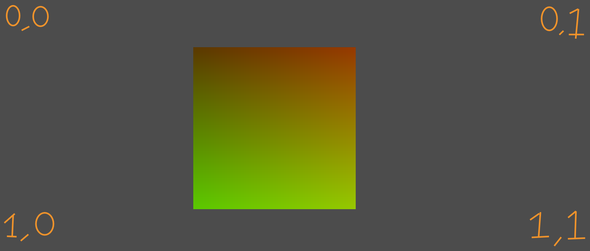
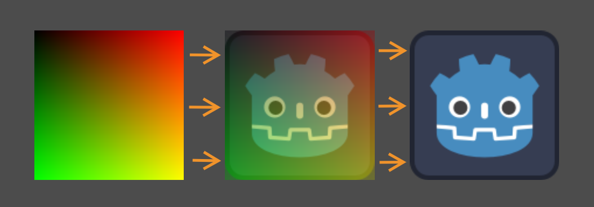

+++
date = '2026-03-07T00:04:39+02:00'
draft = false
title = 'Basics of UVs and Coordinates in Godot Shaders | Tutorial'
tags = ["godot", "shader", "tutorial"]
summary = "A guide about the basics of UVs and Coordinates in Godot Shaders"
series = ["UV"]
series_order = 1
+++
One of the most important concepts to understand when making shaders in Godot is coordinates.

## Why do we need it?
```GLSL
void fragment(){
    // This is the fragment function
}
```

I won't explain fragment here. For that I'd suggest reading [this article](https://shader-tutorial.dev/basics/fragment-shader/). The important thing to note is
that it's where we do most color related things, and even more important is that it runs on **every pixel of your screen**.



And if your shader is attached to a Node in Godot it's basically just confined to that area.



What this means is that when we're writing a **fragment shader**, we're not manipulating a whole image at a time, but rather
all the pixels using the same logic. We're not saying "make this pixel here blue and that pixel red", we're asking "does this pixel meet the conditions to be blue".

But for that we need different conditions in the first place. Otherwise all we could get is a single color.

```GLSL
void fragment(){
    COLOR = vec4(0.0,0.0,1.0,1.0); // Red = 0.0, Green = 0.0, Blue = 1.0, Alpha = 1.0
}
```



Coordinates are those conditions

---

## Different Coordinates
Coordinates like UV give us information on where the pixel actually is. There's a few kinds of coordinates, but the important
ones for us here are:

- `FRAGCOORD`
- `UV`
- `SCREEN_UV`

### FRAGCOORD
It's the position of the fragment on your screen. If you have a **Full HD** screen (1080, 1920) then the `xy` coordinates of `FRAGCOORD` on the pixel
in the middle of your screen would be `(540, 960)`.

It's also important to note that unlike the others, `FRAGCOORD` is has 4 values, so in addition to `x` and `y`, there's also 
`z` which is the depth and `w` which we will ***NOT*** get into here.

> [!NOTE] If you ever visit sites like [shadertoy](https://www.shadertoy.com/) or [fragcoord.xyz](https://fragcoord.xyz/) you'll see `FRAGCOORD` everywhere.
> That's because they don't have the luxuries of a full game engine like **Godot**
> that does a bunch of stuff automatically for us behind the scenes.

### UV
`UV` on the other hand is a 2D coordinate ranging from `(0.0, 0.0)` to `(1.0, 1.0)`. It is calculated from the ***vertices*** of your object. Since we're working in 2D, ***vertices*** really just mean the corners
of our object.



> [!TIP]- If you've ever worked in 3D modeling you know of UV Mapping.
> This is the same thing! These are the same UVs! So If you have a model with unwrapped UVs, that's what you access by using `UV`.
> So imagine the 2D object as just a 3D plane viewed directly (because that's what it basically is)

Since our coordinates are just values and colors are just values it's pretty common to see coordinates visualized like this:

```GLSL
void fragment() {
	COLOR = vec4(UV,0.0,1.0); // Red = UV.x, Green = UV.y, Blue = 0.0, Alpha = 1.0
}
```




### SCREEN_UV
Now similar to `UV`, `SCREEN_UV` is also a 2D coordinate ranging from `(0.0, 0.0)` to `(1.0, 1.0)`, but in the case of `SCREEN_UV` it's for the whole screen.



If our object was to cover the whole screen, like a full screen **ColorRect** for example, the visualization would look like this:

```GLSL
void fragment() {
	COLOR = vec4(SCREEN_UV,0.0,1.0); // Red = SCREEN_UV.x, Green = SCREEN_UV.y, Blue = 0.0, Alpha = 1.0
}
```



But since our object isn't covering the whole screen we can only see what's covered by the object



---

## What are they ACTUALLY used for
Coordinates open up a bunch of possibilities for us. One simple thing is using them to generate shapes directly

### Shapes
We can use `UV.x` to generate a nice gradient for example:

```GLSL
void fragment() {
    float gradient = UV.x;
	COLOR.rgb = vec3(gradient); // Red = gradient, Green = gradient, Blue = gradient
}
```


And because we know that `UV.x` ranges from `0.0` to `1.0`, we can even flip the gradient by subtracting it from `1.0`:

```GLSL
void fragment() {
    float gradient = 1.0 - UV.x;
	COLOR.rgb = vec3(gradient); // Red = gradient, Green = gradient, Blue = gradient
}
```


### Sampling Textures
In game engines like Godot, one of the most important uses for UVs is sampling textures. 

Like we discussed earlier, in shaders you don't just say "This object has a texture", because we're manipulating ***pixels*** and not the whole image.
Now of course using a full game engine like **Godot** gives us the luxury of simply dragging a texture into a texture slot and all the other stuff
happens behind the scenes

But we're writing shaders... this ***IS*** the "behind the scenes".

Until now I've only shown parts of a shader, but for this example we need a full shader:

```GLSL
shader_type canvas_item; // 2D shaders are canvas_items

// uniform is a variable you can see in the editor
// sampler2D means it's a texture
uniform sampler2D our_texture; 

void fragment() {
    vec4 color = texture(our_texture, UV); // Sample our texture at the current UV
    COLOR = color; // Assign the color to the pixel
}
```

>[!IMPORTANT] Remember to assign the texture in your **ShaderMaterial**, I used the Godot logo



Important part here is `texture(our_texture, UV)`. What it does is sample our given texture at the given UV coordinate.
The function is saying "Hey I'm here at `UV` coordinate such and such, could you tell me what `our_texture` looks like here",
And in response we get the color at that coordinate.

So essentially if `UV` is `(0.0, 0.0)` at that pixel, it will sample the top-left-most position on the texture.
And if `UV` is `(1.0, 1.0)`, it will sample the bottom-right-most position on the texture.

If we instead used `SCREEN_UV` in place of `UV`, we'd only see part of our texture:

```GLSL
void fragment() {
    vec4 color = texture(our_texture, SCREEN_UV); // Sample our texture at the current SCREEN_UV
    COLOR = color; // Assign the color to the pixel
}
```


Because in reality `SCREEN_UV` starts from the top-left part of the screen and extends all the way to the bottom-right
while our node really covers just a part of that


---

## What next
In the [next part](../godot_manipulating_uvs/) we'll cover some ways to manipulate UV's to your liking. Things like scaling, rotating and such.
